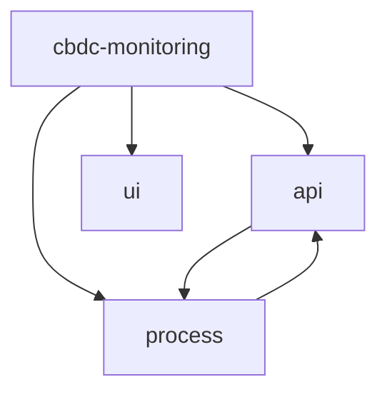

#  cbdc-monitoring presentation

###  contents

-  [mermaid](#mermaid)

## mermaid

```mermaid
graph TD;
    cbdc-monitoring-->api;
    cbdc-monitoring-->process;
    cbdc-monitoring-->ui;
    process-->api;
    api-->process;
```
