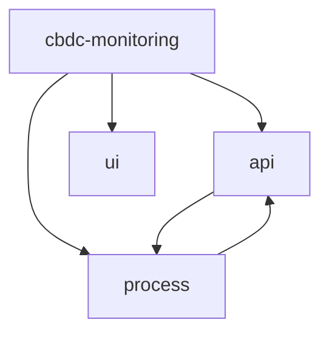

#  cbdc-monitoring presentation

###  contents

-  [mermaid](#mermaid)

## mermaid




```

d."}
[cbdc-monitoring-process]: {"level":50,"time":1690555470278,"msg":"[CBDCALERT005][Rai][error] Error checking alert for rHgXP96garXnY337j9JqnqcLM9NudgSvNi: actNotFound: Account not found."}
[cbdc-monitoring-process]: {"level":50,"time":1690555470278,"msg":"[CBDCALERT005][Rai][error] Error checking alert for raNQ8jnkVf94AzAXwWQ2LyPh69uGPaoGWa: actNotFound: Account not found."}
[cbdc-monitoring-process]: {"level":50,"time":1690555470278,"msg":"[CBDCALERT005][Rai][error] Error checking alert for rwom3JVo4jZRjLezCXiPyjaB2Xpc5cR46z: actNotFound: Account not found."}
[cbdc-monitoring-process]: {"level":30,"time":1690555470371,"msg":"[CBDCALERT005][Rai][info] Executed"}
[cbdc-monitoring-process]: {"level":30,"time":1690555470373,"msg":"[CBDCALERT006][Rai][info] Executed"}
[cbdc-monitoring-process]: {"level":40,"time":1690555470374,"alert":"CBDCALERT002","type":"alert","account":"rHn7yZ6YkBvCsTHgujVjCgnjDumgCvuBE6","message":"[CBDCALERT002][Rai][alert] Balance for rHn7yZ6YkBvCsTHgujVjCgnjDumgCvuBE6 is above threshold (20)."}
[cbdc-monitoring-process]: {"level":40,"time":1690555470374,"alert":"CBDCALERT002","type":"alert","account":"rJQ34ESLEmUz1TngU7xKLTkmT1AsiTaGZy","message":"[CBDCALERT002][Rai][alert] Balance for rJQ34ESLEmUz1TngU7xKLTkmT1AsiTaGZy is above threshold (20)."}
[cbdc-monitoring-process]: {"level":40,"time":1690555470374,"alert":"CBDCALERT002","type":"alert","account":"r9biP5BixnLz7Ujm8UWtfQoGHZ8QinWgLW","message":"[CBDCALERT002][Rai][alert] Balance for r9biP5BixnLz7Ujm8UWtfQoGHZ8QinWgLW is above threshold (20)."}
[cbdc-monitoring-process]: {"level":40,"time":1690555470374,"alert":"CBDCALERT002","type":"alert","account":"rE2pMEVm5fJ6Vpcevhhd2aVGTkB42y8rgf","message":"[CBDCALERT002][Rai][alert] Balance for rE2pMEVm5fJ6Vpcevhhd2aVGTkB42y8rgf is above threshold (20)."}
[cbdc-monitoring-process]: {"level":40,"time":1690555470374,"alert":"CBDCALERT002","type":"alert","account":"rf5cD3EbgyTiK6oswmTKegiDpZoFR77wNE","message":"[CBDCALERT002][Rai][alert] Balance for rf5cD3EbgyTiK6oswmTKegiDpZoFR77wNE is above threshold (20)."}
[cbdc-monitoring-process]: {"level":40,"time":1690555470374,"alert":"CBDCALERT002","type":"alert","account":"rEoE8DTY9nuqbW6A4T4j6fKN8q3YjedsG5","message":"[CBDCALERT002][Rai][alert] Balance for rEoE8DTY9nuqbW6A4T4j6fKN8q3YjedsG5 is above threshold (20)."}
[cbdc-monitoring-process]: {"level":40,"time":1690555470374,"alert":"CBDCALERT002","type":"alert","account":"r4zcuS9RxbWYbk755U1cYY4B6odgDUQCug","message":"[CBDCALERT002][Rai][alert] Balance for r4zcuS9RxbWYbk755U1cYY4B6odgDUQCug is above threshold (20)."}
[cbdc-monitoring-process]: {"level":40,"time":1690555470374,"alert":"CBDCALERT002","type":"alert","account":"rKdoZmdT8ReEzVafzCSDW8k31kFCon5WVp","message":"[CBDCALERT002][Rai][alert] Balance for rKdoZmdT8ReEzVafzCSDW8k31kFCon5WVp is above threshold (20)."}
[cbdc-monitoring-process]: {"level":40,"time":1690555470374,"alert":"CBDCALERT002","type":"alert","account":"rETU12iM6ozfx8V3eBsdYk9ZvoFU4rwfZh","message":"[CBDCALERT002][Rai][alert] Balance for rETU12iM6ozfx8V3eBsdYk9ZvoFU4rwfZh is above threshold (20)."}
[cbdc-monitoring-process]: {"level":40,"time":1690555470374,"alert":"CBDCALERT002","type":"alert","account":"rNE3yFasm9e4oPxjeAEvAFispejnZp39Q9","message":"[CBDCALERT002][Rai][alert] Balance for rNE3yFasm9e4oPxjeAEvAFispejnZp39Q9 is above threshold (20)."}
[cbdc-monitoring-process]: {"level":40,"time":1690555470374,"alert":"CBDCALERT002","type":"alert","account":"rfmV4dQ2X4mtmjXUQeMiW9aVXsksUdssBe","message":"[CBDCALERT002][Rai][alert] Balance for rfmV4dQ2X4mtmjXUQeMiW9aVXsksUdssBe is above threshold (20)."}
[cbdc-monitoring-process]: {"level":40,"time":1690555470374,"alert":"CBDCALERT002","type":"alert","account":"rEraTUWe3TLvBDDcinUxKQfWJT1AejBSis","message":"[CBDCALERT002][Rai][alert] Balance for rEraTUWe3TLvBDDcinUxKQfWJT1AejBSis is above threshold (20)."}
[cbdc-monitoring-process]: {"level":40,"time":1690555470374,"alert":"CBDCALERT002","type":"alert","account":"rsnmzTcD1MLmo17JCKMQ3YiimYZ63jWxhR","message":"[CBDCALERT002][Rai][alert] Balance for rsnmzTcD1MLmo17JCKMQ3YiimYZ63jWxhR is above threshold (20)."}
[cbdc-monitoring-process]: {"level":40,"time":1690555470374,"alert":"CBDCALERT002","type":"alert","account":"rnhpfW8ozGeHac7eyToMDbEKuXoKiVDqDA","message":"[CBDCALERT002][Rai][alert] Balance for rnhpfW8ozGeHac7eyToMDbEKuXoKiVDqDA is above threshold (20)."}
[cbdc-monitoring-process]: {"level":40,"time":1690555470374,"alert":"CBDCALERT002","type":"alert","account":"rhi7vtnedEy9dNApDLnexN8yMZi9na71nG","message":"[CBDCALERT002][Rai][alert] Balance for rhi7vtnedEy9dNApDLnexN8yMZi9na71nG is above threshold (20)."}
[cbdc-monitoring-process]: {"level":40,"time":1690555470375,"alert":"CBDCALERT002","type":"alert","account":"rECBLNNSPx9J2eWRtsLKdjws742GkEDjGM","message":"[CBDCALERT002][Rai][alert] Balance for rECBLNNSPx9J2eWRtsLKdjws742GkEDjGM is above threshold (20)."}
[cbdc-monitoring-process]: {"level":40,"time":1690555470375,"alert":"CBDCALERT002","type":"alert","account":"rPPgJpGFrnPW1Gz7CvQhezyuUASK68W5Nh","message":"[CBDCALERT002][Rai][alert] Balance for rPPgJpGFrnPW1Gz7CvQhezyuUASK68W5Nh is above threshold (20)."}
[cbdc-monitoring-process]: {"level":40,"time":1690555470376,"alert":"CBDCALERT002","type":"alert","account":"r9sDgwUPCyN6ajVy9HoT7w2cMqCUfW6Fa1","message":"[CBDCALERT002][Rai][alert] Balance for r9sDgwUPCyN6ajVy9HoT7w2cMqCUfW6Fa1 is above threshold (20)."}
[cbdc-monitoring-process]: {"level":30,"time":1690555470376,"msg":"[CBDCALERT002][Rai][info] Executed"}
[cbdc-monitoring-process]: {"level":30,"time":1690555500163,"msg":"[CBDCALERT006][Rai][info] Executed"}
[cbdc-monitoring-process]: {"level":40,"time":1690555500171,"alert":"CBDCALERT001","type":"alert","account":"raez5u4JfuDHB98KrJfoPfhGSQUR9u62Ku","message":"[CBDCALERT001][Rai][alert] Trustline raez5u4JfuDHB98KrJfoPfhGSQUR9u62Ku to issuer rngdKd8BAM3etQcb12DvGxd5Ps9MocAvPa is not allowed"}
[cbdc-monitoring-process]: {"level":40,"time":1690555500171,"alert":"CBDCALERT001","type":"alert","account":"rHoKckiKHNZV63RYmHDgAByqcG2uYf2QDS","message":"[CBDCALERT001][Rai][alert] Trustline rHoKckiKHNZV63RYmHDgAByqcG2uYf2QDS to issuer rngdKd8BAM3etQcb12DvGxd5Ps9MocAvPa is not allowed"}
[cbdc-monitoring-process]: {"level":30,"time":1690555500171,"msg":"[CBDCALERT001][Rai][info] Executed"}
[cbdc-monitoring-process]: {"level":50,"time":1690555500172,"msg":"[CBDCALERT005][Rai][error] Error checking alert for rNEmv2xGmndqWVJWrm7T2R28mqgseJ5LGj: actNotFound: Account not found."}
[cbdc-monitoring-process]: {"level":50,"time":1690555500172,"msg":"[CBDCALERT005][Rai][error] Error checking alert for rKnFpKmExc6F34U4KtDFaefkpWKbVJiSmj: actNotFound: Account not found."}
[cbdc-monitoring-process]: {"level":50,"time":1690555500173,"msg":"[CBDCALERT005][Rai][error] Error checking alert for rfXZkTZ6YfaUJXBcetWSqSMPbVFtafZy6M: actNotFound: Account not found."}
[cbdc-monitoring-process]: {"level":50,"time":1690555500173,"msg":"[CBDCALERT005][Rai][error] Error checking alert for rnSjkzni32BocN9hqpBUVGXPRg6hm2EwW9: actNotFound: Account not found."}
[cbdc-monitoring-process]: {"level":50,"time":1690555500173,"msg":"[CBDCALERT005][Rai][error] Error checking alert for r3GyeKWHNnFekNz2PnD6uqJbVkNkuGi4AU: actNotFound: Account not found."}
[cbdc-monitoring-process]: {"level":50,"time":1690555500263,"msg":"[CBDCALERT005][Rai][error] Error checking alert for rhzsVMBR3XJWN4YqKgoNhtEg5xcxzEcnKE: actNotFound: Account not found."}
[cbdc-monitoring-process]: {"level":50,"time":1690555500263,"msg":"[CBDCALERT005][Rai][error] Error checking alert for rHgXP96garXnY337j9JqnqcLM9NudgSvNi: actNotFound: Account not found."}
[cbdc-monitoring-process]: {"level":50,"time":1690555500264,"msg":"[CBDCALERT005][Rai][error] Error checking alert for raNQ8jnkVf94AzAXwWQ2LyPh69uGPaoGWa: actNotFound: Account not found."}
[cbdc-monitoring-process]: {"level":50,"time":1690555500264,"msg":"[CBDCALERT005][Rai][error] Error checking alert for rwom3JVo4jZRjLezCXiPyjaB2Xpc5cR46z: actNotFound: Account not found."}
[cbdc-monitoring-process]: {"level":30,"time":1690555500367,"msg":"[CBDCALERT005][Rai][info] Executed"}
[cbdc-monitoring-process]: {"level":40,"time":1690555500369,"alert":"CBDCALERT002","type":"alert","account":"rHn7yZ6YkBvCsTHgujVjCgnjDumgCvuBE6","message":"[CBDCALERT002][Rai][alert] Balance for rHn7yZ6YkBvCsTHgujVjCgnjDumgCvuBE6 is above threshold (20)."}
[cbdc-monitoring-process]: {"level":40,"time":1690555500369,"alert":"CBDCALERT002","type":"alert","account":"rJQ34ESLEmUz1TngU7xKLTkmT1AsiTaGZy","message":"[CBDCALERT002][Rai][alert] Balance for rJQ34ESLEmUz1TngU7xKLTkmT1AsiTaGZy is above threshold (20)."}
[cbdc-monitoring-process]: {"level":40,"time":1690555500369,"alert":"CBDCALERT002","type":"alert","account":"r9biP5BixnLz7Ujm8UWtfQoGHZ8QinWgLW","message":"[CBDCALERT002][Rai][alert] Balance for r9biP5BixnLz7Ujm8UWtfQoGHZ8QinWgLW is above threshold (20)."}
[cbdc-monitoring-process]: {"level":40,"time":1690555500369,"alert":"CBDCALERT002","type":"alert","account":"rE2pMEVm5fJ6Vpcevhhd2aVGTkB42y8rgf","message":"[CBDCALERT002][Rai][alert] Balance for rE2pMEVm5fJ6Vpcevhhd2aVGTkB42y8rgf is above threshold (20)."}
[cbdc-monitoring-process]: {"level":40,"time":1690555500369,"alert":"CBDCALERT002","type":"alert","account":"rf5cD3EbgyTiK6oswmTKegiDpZoFR77wNE","message":"[CBDCALERT002][Rai][alert] Balance for rf5cD3EbgyTiK6oswmTKegiDpZoFR77wNE is above threshold (20)."}
[cbdc-monitoring-process]: {"level":40,"time":1690555500369,"alert":"CBDCALERT002","type":"alert","account":"rEoE8DTY9nuqbW6A4T4j6fKN8q3YjedsG5","message":"[CBDCALERT002][Rai][alert] Balance for rEoE8DTY9nuqbW6A4T4j6fKN8q3YjedsG5 is above threshold (20)."}
[cbdc-monitoring-process]: {"level":40,"time":1690555500369,"alert":"CBDCALERT002","type":"alert","account":"r4zcuS9RxbWYbk755U1cYY4B6odgDUQCug","message":"[CBDCALERT002][Rai][alert] Balance for r4zcuS9RxbWYbk755U1cYY4B6odgDUQCug is above threshold (20)."}
[cbdc-monitoring-process]: {"level":40,"time":1690555500369,"alert":"CBDCALERT002","type":"alert","account":"rKdoZmdT8ReEzVafzCSDW8k31kFCon5WVp","message":"[CBDCALERT002][Rai][alert] Balance for rKdoZmdT8ReEzVafzCSDW8k31kFCon5WVp is above threshold (20)."}
[cbdc-monitoring-process]: {"level":40,"time":1690555500369,"alert":"CBDCALERT002","type":"alert","account":"rETU12iM6ozfx8V3eBsdYk9ZvoFU4rwfZh","message":"[CBDCALERT002][Rai][alert] Balance for rETU12iM6ozfx8V3eBsdYk9ZvoFU4rwfZh is above threshold (20)."}
[cbdc-monitoring-process]: {"level":40,"time":1690555500369,"alert":"CBDCALERT002","type":"alert","account":"rNE3yFasm9e4oPxjeAEvAFispejnZp39Q9","message":"[CBDCALERT002][Rai][alert] Balance for rNE3yFasm9e4oPxjeAEvAFispejnZp39Q9 is above threshold (20)."}
[cbdc-monitoring-process]: {"level":40,"time":1690555500373,"alert":"CBDCALERT002","type":"alert","account":"rfmV4dQ2X4mtmjXUQeMiW9aVXsksUdssBe","message":"[CBDCALERT002][Rai][alert] Balance for rfmV4dQ2X4mtmjXUQeMiW9aVXsksUdssBe is above threshold (20)."}
[cbdc-monitoring-process]: {"level":40,"time":1690555500373,"alert":"CBDCALERT002","type":"alert","account":"rEraTUWe3TLvBDDcinUxKQfWJT1AejBSis","message":"[CBDCALERT002][Rai][alert] Balance for rEraTUWe3TLvBDDcinUxKQfWJT1AejBSis is above threshold (20)."}
[cbdc-monitoring-process]: {"level":40,"time":1690555500373,"alert":"CBDCALERT002","type":"alert","account":"rsnmzTcD1MLmo17JCKMQ3YiimYZ63jWxhR","message":"[CBDCALERT002][Rai][alert] Balance for rsnmzTcD1MLmo17JCKMQ3YiimYZ63jWxhR is above threshold (20)."}
[cbdc-monitoring-process]: {"level":40,"time":1690555500373,"alert":"CBDCALERT002","type":"alert","account":"rnhpfW8ozGeHac7eyToMDbEKuXoKiVDqDA","message":"[CBDCALERT002][Rai][alert] Balance for rnhpfW8ozGeHac7eyToMDbEKuXoKiVDqDA is above threshold (20)."}
[cbdc-monitoring-process]: {"level":40,"time":1690555500374,"alert":"CBDCALERT002","type":"alert","account":"rhi7vtnedEy9dNApDLnexN8yMZi9na71nG","message":"[CBDCALERT002][Rai][alert] Balance for rhi7vtnedEy9dNApDLnexN8yMZi9na71nG is above threshold (20)."}
[cbdc-monitoring-process]: {"level":40,"time":1690555500374,"alert":"CBDCALERT002","type":"alert","account":"rECBLNNSPx9J2eWRtsLKdjws742GkEDjGM","message":"[CBDCALERT002][Rai][alert] Balance for rECBLNNSPx9J2eWRtsLKdjws742GkEDjGM is above threshold (20)."}
[cbdc-monitoring-process]: {"level":40,"time":1690555500374,"alert":"CBDCALERT002","type":"alert","account":"rPPgJpGFrnPW1Gz7CvQhezyuUASK68W5Nh","message":"[CBDCALERT002][Rai][alert] Balance for rPPgJpGFrnPW1Gz7CvQhezyuUASK68W5Nh is above threshold (20)."}
[cbdc-monitoring-process]: {"level":40,"time":1690555500375,"alert":"CBDCALERT002","type":"alert","account":"r9sDgwUPCyN6ajVy9HoT7w2cMqCUfW6Fa1","message":"[CBDCALERT002][Rai][alert] Balance for r9sDgwUPCyN6ajVy9HoT7w2cMqCUfW6Fa1 is above threshold (20)."}
[cbdc-monitoring-process]: {"level":30,"time":1690555500375,"msg":"[CBDCALERT002][Rai][info] Executed"}
[cbdc-monitoring-process]: {"level":30,"time":1690555530139,"msg":"[CBDCALERT006][Rai][info] Executed"}
[cbdc-monitoring-process]: {"level":50,"time":1690555530140,"msg":"[CBDCALERT005][Rai][error] Error checking alert for rNEmv2xGmndqWVJWrm7T2R28mqgseJ5LGj: actNotFound: Account not found."}
[cbdc-monitoring-process]: {"level":50,"time":1690555530140,"msg":"[CBDCALERT005][Rai][error] Error checking alert for rKnFpKmExc6F34U4KtDFaefkpWKbVJiSmj: actNotFound: Account not found."}
[cbdc-monitoring-process]: {"level":50,"time":1690555530140,"msg":"[CBDCALERT005][Rai][error] Error checking alert for rfXZkTZ6YfaUJXBcetWSqSMPbVFtafZy6M: actNotFound: Account not found."}
[cbdc-monitoring-process]: {"level":50,"time":1690555530140,"msg":"[CBDCALERT005][Rai][error] Error checking alert for rnSjkzni32BocN9hqpBUVGXPRg6hm2EwW9: actNotFound: Account not found."}
[cbdc-monitoring-process]: {"level":50,"time":1690555530141,"msg":"[CBDCALERT005][Rai][error] Error checking alert for r3GyeKWHNnFekNz2PnD6uqJbVkNkuGi4AU: actNotFound: Account not found."}
[cbdc-monitoring-process]: {"level":50,"time":1690555530141,"msg":"[CBDCALERT005][Rai][error] Error checking alert for rhzsVMBR3XJWN4YqKgoNhtEg5xcxzEcnKE: actNotFound: Account not found."}
[cbdc-monitoring-process]: {"level":50,"time":1690555530141,"msg":"[CBDCALERT005][Rai][error] Error checking alert for rHgXP96garXnY337j9JqnqcLM9NudgSvNi: actNotFound: Account not found."}
[cbdc-monitoring-process]: {"level":50,"time":1690555530150,"msg":"[CBDCALERT005][Rai][error] Error checking alert for raNQ8jnkVf94AzAXwWQ2LyPh69uGPaoGWa: actNotFound: Account not found."}
[cbdc-monitoring-process]: {"level":50,"time":1690555530150,"msg":"[CBDCALERT005][Rai][error] Error checking alert for rwom3JVo4jZRjLezCXiPyjaB2Xpc5cR46z: actNotFound: Account not found."}
[cbdc-monitoring-process]: {"level":30,"time":1690555530300,"msg":"[CBDCALERT005][Rai][info] Executed"}
[cbdc-monitoring-process]: {"level":40,"time":1690555530301,"alert":"CBDCALERT002","type":"alert","account":"rHn7yZ6YkBvCsTHgujVjCgnjDumgCvuBE6","message":"[CBDCALERT002][Rai][alert] Balance for rHn7yZ6YkBvCsTHgujVjCgnjDumgCvuBE6 is above threshold (20)."}
[cbdc-monitoring-process]: {"level":40,"time":1690555530301,"alert":"CBDCALERT002","type":"alert","account":"rJQ34ESLEmUz1TngU7xKLTkmT1AsiTaGZy","message":"[CBDCALERT002][Rai][alert] Balance for rJQ34ESLEmUz1TngU7xKLTkmT1AsiTaGZy is above threshold (20)."}
[cbdc-monitoring-process]: {"level":40,"time":1690555530301,"alert":"CBDCALERT002","type":"alert","account":"r9biP5BixnLz7Ujm8UWtfQoGHZ8QinWgLW","message":"[CBDCALERT002][Rai][alert] Balance for r9biP5BixnLz7Ujm8UWtfQoGHZ8QinWgLW is above threshold (20)."}
[cbdc-monitoring-process]: {"level":40,"time":1690555530301,"alert":"CBDCALERT002","type":"alert","account":"rE2pMEVm5fJ6Vpcevhhd2aVGTkB42y8rgf","message":"[CBDCALERT002][Rai][alert] Balance for rE2pMEVm5fJ6Vpcevhhd2aVGTkB42y8rgf is above threshold (20)."}
[cbdc-monitoring-process]: {"level":40,"time":1690555530301,"alert":"CBDCALERT002","type":"alert","account":"rf5cD3EbgyTiK6oswmTKegiDpZoFR77wNE","message":"[CBDCALERT002][Rai][alert] Balance for rf5cD3EbgyTiK6oswmTKegiDpZoFR77wNE is above threshold (20)."}
[cbdc-monitoring-process]: {"level":40,"time":1690555530302,"alert":"CBDCALERT002","type":"alert","account":"rEoE8DTY9nuqbW6A4T4j6fKN8q3YjedsG5","message":"[CBDCALERT002][Rai][alert] Balance for rEoE8DTY9nuqbW6A4T4j6fKN8q3YjedsG5 is above threshold (20)."}
[cbdc-monitoring-process]: {"level":40,"time":1690555530331,"alert":"CBDCALERT002","type":"alert","account":"r4zcuS9RxbWYbk755U1cYY4B6odgDUQCug","message":"[CBDCALERT002][Rai][alert] Balance for r4zcuS9RxbWYbk755U1cYY4B6odgDUQCug is above threshold (20)."}
[cbdc-monitoring-process]: {"level":40,"time":1690555530331,"alert":"CBDCALERT002","type":"alert","account":"rKdoZmdT8ReEzVafzCSDW8k31kFCon5WVp","message":"[CBDCALERT002][Rai][alert] Balance for rKdoZmdT8ReEzVafzCSDW8k31kFCon5WVp is above threshold (20)."}
[cbdc-monitoring-process]: {"level":40,"time":1690555530331,"alert":"CBDCALERT002","type":"alert","account":"rETU12iM6ozfx8V3eBsdYk9ZvoFU4rwfZh","message":"[CBDCALERT002][Rai][alert] Balance for rETU12iM6ozfx8V3eBsdYk9ZvoFU4rwfZh is above threshold (20)."}
[cbdc-monitoring-process]: {"level":40,"time":1690555530331,"alert":"CBDCALERT002","type":"alert","account":"rNE3yFasm9e4oPxjeAEvAFispejnZp39Q9","message":"[CBDCALERT002][Rai][alert] Balance for rNE3yFasm9e4oPxjeAEvAFispejnZp39Q9 is above threshold (20)."}
[cbdc-monitoring-process]: {"level":40,"time":1690555530331,"alert":"CBDCALERT002","type":"alert","account":"rfmV4dQ2X4mtmjXUQeMiW9aVXsksUdssBe","message":"[CBDCALERT002][Rai][alert] Balance for rfmV4dQ2X4mtmjXUQeMiW9aVXsksUdssBe is above threshold (20)."}
[cbdc-monitoring-process]: {"level":40,"time":1690555530331,"alert":"CBDCALERT002","type":"alert","account":"rEraTUWe3TLvBDDcinUxKQfWJT1AejBSis","message":"[CBDCALERT002][Rai][alert] Balance for rEraTUWe3TLvBDDcinUxKQfWJT1AejBSis is above threshold (20)."}
[cbdc-monitoring-process]: {"level":40,"time":1690555530331,"alert":"CBDCALERT002","type":"alert","account":"rsnmzTcD1MLmo17JCKMQ3YiimYZ63jWxhR","message":"[CBDCALERT002][Rai][alert] Balance for rsnmzTcD1MLmo17JCKMQ3YiimYZ63jWxhR is above threshold (20)."}
[cbdc-monitoring-process]: {"level":40,"time":1690555530332,"alert":"CBDCALERT002","type":"alert","account":"rnhpfW8ozGeHac7eyToMDbEKuXoKiVDqDA","message":"[CBDCALERT002][Rai][alert] Balance for rnhpfW8ozGeHac7eyToMDbEKuXoKiVDqDA is above threshold (20)."}
[cbdc-monitoring-process]: {"level":40,"time":1690555530332,"alert":"CBDCALERT002","type":"alert","account":"rhi7vtnedEy9dNApDLnexN8yMZi9na71nG","message":"[CBDCALERT002][Rai][alert] Balance for rhi7vtnedEy9dNApDLnexN8yMZi9na71nG is above threshold (20)."}
[cbdc-monitoring-process]: {"level":40,"time":1690555530332,"alert":"CBDCALERT002","type":"alert","account":"rECBLNNSPx9J2eWRtsLKdjws742GkEDjGM","message":"[CBDCALERT002][Rai][alert] Balance for rECBLNNSPx9J2eWRtsLKdjws742GkEDjGM is above threshold (20)."}
[cbdc-monitoring-process]: {"level":40,"time":1690555530394,"alert":"CBDCALERT002","type":"alert","account":"rPPgJpGFrnPW1Gz7CvQhezyuUASK68W5Nh","message":"[CBDCALERT002][Rai][alert] Balance for rPPgJpGFrnPW1Gz7CvQhezyuUASK68W5Nh is above threshold (20)."}
[cbdc-monitoring-process]: {"level":40,"time":1690555530394,"alert":"CBDCALERT002","type":"alert","account":"r9sDgwUPCyN6ajVy9HoT7w2cMqCUfW6Fa1","message":"[CBDCALERT002][Rai][alert] Balance for r9sDgwUPCyN6ajVy9HoT7w2cMqCUfW6Fa1 is above threshold (20)."}
[cbdc-monitoring-process]: {"level":30,"time":1690555530394,"msg":"[CBDCALERT002][Rai][info] Executed"}
[cbdc-monitoring-process]: {"level":40,"time":1690555530395,"alert":"CBDCALERT001","type":"alert","account":"raez5u4JfuDHB98KrJfoPfhGSQUR9u62Ku","message":"[CBDCALERT001][Rai][alert] Trustline raez5u4JfuDHB98KrJfoPfhGSQUR9u62Ku to issuer rngdKd8BAM3etQcb12DvGxd5Ps9MocAvPa is not allowed"}
[cbdc-monitoring-process]: {"level":40,"time":1690555530395,"alert":"CBDCALERT001","type":"alert","account":"rHoKckiKHNZV63RYmHDgAByqcG2uYf2QDS","message":"[CBDCALERT001][Rai][alert] Trustline rHoKckiKHNZV63RYmHDgAByqcG2uYf2QDS to issuer rngdKd8BAM3etQcb12DvGxd5Ps9MocAvPa is not allowed"}
[cbdc-monitoring-process]: {"level":30,"time":1690555530395,"msg":"[CBDCALERT001][Rai][info] Executed"}
[cbdc-monitoring-process]: {"level":30,"time":1690555560125,"msg":"[CBDCALERT006][Rai][info] Executed"}
[cbdc-monitoring-process]: {"level":40,"time":1690555560170,"alert":"CBDCALERT001","type":"alert","account":"raez5u4JfuDHB98KrJfoPfhGSQUR9u62Ku","message":"[CBDCALERT001][Rai][alert] Trustline raez5u4JfuDHB98KrJfoPfhGSQUR9u62Ku to issuer rngdKd8BAM3etQcb12DvGxd5Ps9MocAvPa is not allowed"}
[cbdc-monitoring-process]: {"level":40,"time":1690555560170,"alert":"CBDCALERT001","type":"alert","account":"rHoKckiKHNZV63RYmHDgAByqcG2uYf2QDS","message":"[CBDCALERT001][Rai][alert] Trustline rHoKckiKHNZV63RYmHDgAByqcG2uYf2QDS to issuer rngdKd8BAM3etQcb12DvGxd5Ps9MocAvPa is not allowed"}
[cbdc-monitoring-process]: {"level":30,"time":1690555560170,"msg":"[CBDCALERT001][Rai][info] Executed"}
[cbdc-monitoring-process]: {"level":50,"time":1690555560171,"msg":"[CBDCALERT005][Rai][error] Error checking alert for rNEmv2xGmndqWVJWrm7T2R28mqgseJ5LGj: actNotFound: Account not found."}
[cbdc-monitoring-process]: {"level":50,"time":1690555560171,"msg":"[CBDCALERT005][Rai][error] Error checking alert for rKnFpKmExc6F34U4KtDFaefkpWKbVJiSmj: actNotFound: Account not found."}
[cbdc-monitoring-process]: {"level":50,"time":1690555560171,"msg":"[CBDCALERT005][Rai][error] Error checking alert for rfXZkTZ6YfaUJXBcetWSqSMPbVFtafZy6M: actNotFound: Account not found."}
[cbdc-monitoring-process]: {"level":50,"time":1690555560171,"msg":"[CBDCALERT005][Rai][error] Error checking alert for rnSjkzni32BocN9hqpBUVGXPRg6hm2EwW9: actNotFound: Account not found."}
[cbdc-monitoring-process]: {"level":50,"time":1690555560172,"msg":"[CBDCALERT005][Rai][error] Error checking alert for r3GyeKWHNnFekNz2PnD6uqJbVkNkuGi4AU: actNotFound: Account not found."}
[cbdc-monitoring-process]: {"level":50,"time":1690555560230,"msg":"[CBDCALERT005][Rai][error] Error checking alert for rhzsVMBR3XJWN4YqKgoNhtEg5xcxzEcnKE: actNotFound: Account not found."}
[cbdc-monitoring-process]: {"level":50,"time":1690555560230,"msg":"[CBDCALERT005][Rai][error] Error checking alert for rHgXP96garXnY337j9JqnqcLM9NudgSvNi: actNotFound: Account not found."}
[cbdc-monitoring-process]: {"level":50,"time":1690555560230,"msg":"[CBDCALERT005][Rai][error] Error checking alert for raNQ8jnkVf94AzAXwWQ2LyPh69uGPaoGWa: actNotFound: Account not found."}
[cbdc-monitoring-process]: {"level":50,"time":1690555560230,"msg":"[CBDCALERT005][Rai][error] Error checking alert for rwom3JVo4jZRjLezCXiPyjaB2Xpc5cR46z: actNotFound: Account not found."}
[cbdc-monitoring-process]: {"level":30,"time":1690555560454,"msg":"[CBDCALERT005][Rai][info] Executed"}
[cbdc-monitoring-process]: {"level":40,"time":1690555560457,"alert":"CBDCALERT002","type":"alert","account":"rHn7yZ6YkBvCsTHgujVjCgnjDumgCvuBE6","message":"[CBDCALERT002][Rai][alert] Balance for rHn7yZ6YkBvCsTHgujVjCgnjDumgCvuBE6 is above threshold (20)."}
[cbdc-monitoring-process]: {"level":40,"time":1690555560457,"alert":"CBDCALERT002","type":"alert","account":"rJQ34ESLEmUz1TngU7xKLTkmT1AsiTaGZy","message":"[CBDCALERT002][Rai][alert] Balance for rJQ34ESLEmUz1TngU7xKLTkmT1AsiTaGZy is above threshold (20)."}
[cbdc-monitoring-process]: {"level":40,"time":1690555560457,"alert":"CBDCALERT002","type":"alert","account":"r9biP5BixnLz7Ujm8UWtfQoGHZ8QinWgLW","message":"[CBDCALERT002][Rai][alert] Balance for r9biP5BixnLz7Ujm8UWtfQoGHZ8QinWgLW is above threshold (20)."}
[cbdc-monitoring-process]: {"level":40,"time":1690555560458,"alert":"CBDCALERT002","type":"alert","account":"rE2pMEVm5fJ6Vpcevhhd2aVGTkB42y8rgf","message":"[CBDCALERT002][Rai][alert] Balance for rE2pMEVm5fJ6Vpcevhhd2aVGTkB42y8rgf is above threshold (20)."}
[cbdc-monitoring-process]: {"level":40,"time":1690555560458,"alert":"CBDCALERT002","type":"alert","account":"rf5cD3EbgyTiK6oswmTKegiDpZoFR77wNE","message":"[CBDCALERT002][Rai][alert] Balance for rf5cD3EbgyTiK6oswmTKegiDpZoFR77wNE is above threshold (20)."}
[cbdc-monitoring-process]: {"level":40,"time":1690555560458,"alert":"CBDCALERT002","type":"alert","account":"rEoE8DTY9nuqbW6A4T4j6fKN8q3YjedsG5","message":"[CBDCALERT002][Rai][alert] Balance for rEoE8DTY9nuqbW6A4T4j6fKN8q3YjedsG5 is above threshold (20)."}
[cbdc-monitoring-process]: {"level":40,"time":1690555560458,"alert":"CBDCALERT002","type":"alert","account":"r4zcuS9RxbWYbk755U1cYY4B6odgDUQCug","message":"[CBDCALERT002][Rai][alert] Balance for r4zcuS9RxbWYbk755U1cYY4B6odgDUQCug is above threshold (20)."}
[cbdc-monitoring-process]: {"level":40,"time":1690555560458,"alert":"CBDCALERT002","type":"alert","account":"rKdoZmdT8ReEzVafzCSDW8k31kFCon5WVp","message":"[CBDCALERT002][Rai][alert] Balance for rKdoZmdT8ReEzVafzCSDW8k31kFCon5WVp is above threshold (20)."}
[cbdc-monitoring-process]: {"level":40,"time":1690555560458,"alert":"CBDCALERT002","type":"alert","account":"rETU12iM6ozfx8V3eBsdYk9ZvoFU4rwfZh","message":"[CBDCALERT002][Rai][alert] Balance for rETU12iM6ozfx8V3eBsdYk9ZvoFU4rwfZh is above threshold (20)."}
[cbdc-monitoring-process]: {"level":40,"time":1690555560458,"alert":"CBDCALERT002","type":"alert","account":"rNE3yFasm9e4oPxjeAEvAFispejnZp39Q9","message":"[CBDCALERT002][Rai][alert] Balance for rNE3yFasm9e4oPxjeAEvAFispejnZp39Q9 is above threshold (20)."}
[cbdc-monitoring-process]: {"level":40,"time":1690555560458,"alert":"CBDCALERT002","type":"alert","account":"rfmV4dQ2X4mtmjXUQeMiW9aVXsksUdssBe","message":"[CBDCALERT002][Rai][alert] Balance for rfmV4dQ2X4mtmjXUQeMiW9aVXsksUdssBe is above threshold (20)."}
[cbdc-monitoring-process]: {"level":40,"time":1690555560458,"alert":"CBDCALERT002","type":"alert","account":"rEraTUWe3TLvBDDcinUxKQfWJT1AejBSis","message":"[CBDCALERT002][Rai][alert] Balance for rEraTUWe3TLvBDDcinUxKQfWJT1AejBSis is above threshold (20)."}
[cbdc-monitoring-process]: {"level":40,"time":1690555560458,"alert":"CBDCALERT002","type":"alert","account":"rsnmzTcD1MLmo17JCKMQ3YiimYZ63jWxhR","message":"[CBDCALERT002][Rai][alert] Balance for rsnmzTcD1MLmo17JCKMQ3YiimYZ63jWxhR is above threshold (20)."}
[cbdc-monitoring-process]: {"level":40,"time":1690555560458,"alert":"CBDCALERT002","type":"alert","account":"rnhpfW8ozGeHac7eyToMDbEKuXoKiVDqDA","message":"[CBDCALERT002][Rai][alert] Balance for rnhpfW8ozGeHac7eyToMDbEKuXoKiVDqDA is above threshold (20)."}
[cbdc-monitoring-process]: {"level":40,"time":1690555560461,"alert":"CBDCALERT002","type":"alert","account":"rhi7vtnedEy9dNApDLnexN8yMZi9na71nG","message":"[CBDCALERT002][Rai][alert] Balance for rhi7vtnedEy9dNApDLnexN8yMZi9na71nG is above threshold (20)."}
[cbdc-monitoring-process]: {"level":40,"time":1690555560463,"alert":"CBDCALERT002","type":"alert","account":"rECBLNNSPx9J2eWRtsLKdjws742GkEDjGM","message":"[CBDCALERT002][Rai][alert] Balance for rECBLNNSPx9J2eWRtsLKdjws742GkEDjGM is above threshold (20)."}
[cbdc-monitoring-process]: {"level":40,"time":1690555560463,"alert":"CBDCALERT002","type":"alert","account":"rPPgJpGFrnPW1Gz7CvQhezyuUASK68W5Nh","message":"[CBDCALERT002][Rai][alert] Balance for rPPgJpGFrnPW1Gz7CvQhezyuUASK68W5Nh is above threshold (20)."}
[cbdc-monitoring-process]: {"level":40,"time":1690555560463,"alert":"CBDCALERT002","type":"alert","account":"r9sDgwUPCyN6ajVy9HoT7w2cMqCUfW6Fa1","message":"[CBDCALERT002][Rai][alert] Balance for r9sDgwUPCyN6ajVy9HoT7w2cMqCUfW6Fa1 is above threshold (20)."}
[cbdc-monitoring-process]: {"level":30,"time":1690555560463,"msg":"[CBDCALERT002][Rai][info] Executed"}
[cbdc-monitoring-process]: {"level":40,"time":1690555590211,"alert":"CBDCALERT001","type":"alert","account":"raez5u4JfuDHB98KrJfoPfhGSQUR9u62Ku","message":"[CBDCALERT001][Rai][alert] Trustline raez5u4JfuDHB98KrJfoPfhGSQUR9u62Ku to issuer rngdKd8BAM3etQcb12DvGxd5Ps9MocAvPa is not allowed"}
[cbdc-monitoring-process]: {"level":40,"time":1690555590212,"alert":"CBDCALERT001","type":"alert","account":"rHoKckiKHNZV63RYmHDgAByqcG2uYf2QDS","message":"[CBDCALERT001][Rai][alert] Trustline rHoKckiKHNZV63RYmHDgAByqcG2uYf2QDS to issuer rngdKd8BAM3etQcb12DvGxd5Ps9MocAvPa is not allowed"}
[cbdc-monitoring-process]: {"level":30,"time":1690555590212,"msg":"[CBDCALERT001][Rai][info] Executed"}
[cbdc-monitoring-process]: {"level":40,"time":1690555590229,"alert":"CBDCALERT002","type":"alert","account":"rHn7yZ6YkBvCsTHgujVjCgnjDumgCvuBE6","message":"[CBDCALERT002][Rai][alert] Balance for rHn7yZ6YkBvCsTHgujVjCgnjDumgCvuBE6 is above threshold (20)."}
[cbdc-monitoring-process]: {"level":40,"time":1690555590229,"alert":"CBDCALERT002","type":"alert","account":"rJQ34ESLEmUz1TngU7xKLTkmT1AsiTaGZy","message":"[CBDCALERT002][Rai][alert] Balance for rJQ34ESLEmUz1TngU7xKLTkmT1AsiTaGZy is above threshold (20)."}
[cbdc-monitoring-process]: {"level":40,"time":1690555590229,"alert":"CBDCALERT002","type":"alert","account":"r9biP5BixnLz7Ujm8UWtfQoGHZ8QinWgLW","message":"[CBDCALERT002][Rai][alert] Balance for r9biP5BixnLz7Ujm8UWtfQoGHZ8QinWgLW is above threshold (20)."}
[cbdc-monitoring-process]: {"level":40,"time":1690555590229,"alert":"CBDCALERT002","type":"alert","account":"rE2pMEVm5fJ6Vpcevhhd2aVGTkB42y8rgf","message":"[CBDCALERT002][Rai][alert] Balance for rE2pMEVm5fJ6Vpcevhhd2aVGTkB42y8rgf is above threshold (20)."}
[cbdc-monitoring-process]: {"level":40,"time":1690555590229,"alert":"CBDCALERT002","type":"alert","account":"rf5cD3EbgyTiK6oswmTKegiDpZoFR77wNE","message":"[CBDCALERT002][Rai][alert] Balance for rf5cD3EbgyTiK6oswmTKegiDpZoFR77wNE is above threshold (20)."}
[cbdc-monitoring-process]: {"level":40,"time":1690555590229,"alert":"CBDCALERT002","type":"alert","account":"rEoE8DTY9nuqbW6A4T4j6fKN8q3YjedsG5","message":"[CBDCALERT002][Rai][alert] Balance for rEoE8DTY9nuqbW6A4T4j6fKN8q3YjedsG5 is above threshold (20)."}
[cbdc-monitoring-process]: {"level":40,"time":1690555590230,"alert":"CBDCALERT002","type":"alert","account":"r4zcuS9RxbWYbk755U1cYY4B6odgDUQCug","message":"[CBDCALERT002][Rai][alert] Balance for r4zcuS9RxbWYbk755U1cYY4B6odgDUQCug is above threshold (20)."}
[cbdc-monitoring-process]: {"level":40,"time":1690555590230,"alert":"CBDCALERT002","type":"alert","account":"rKdoZmdT8ReEzVafzCSDW8k31kFCon5WVp","message":"[CBDCALERT002][Rai][alert] Balance for rKdoZmdT8ReEzVafzCSDW8k31kFCon5WVp is above threshold (20)."}
[cbdc-monitoring-process]: {"level":40,"time":1690555590230,"alert":"CBDCALERT002","type":"alert","account":"rETU12iM6ozfx8V3eBsdYk9ZvoFU4rwfZh","message":"[CBDCALERT002][Rai][alert] Balance for rETU12iM6ozfx8V3eBsdYk9ZvoFU4rwfZh is above threshold (20)."}
[cbdc-monitoring-process]: {"level":40,"time":1690555590231,"alert":"CBDCALERT002","type":"alert","account":"rNE3yFasm9e4oPxjeAEvAFispejnZp39Q9","message":"[CBDCALERT002][Rai][alert] Balance for rNE3yFasm9e4oPxjeAEvAFispejnZp39Q9 is above threshold (20)."}
[cbdc-monitoring-process]: {"level":40,"time":1690555590231,"alert":"CBDCALERT002","type":"alert","account":"rfmV4dQ2X4mtmjXUQeMiW9aVXsksUdssBe","message":"[CBDCALERT002][Rai][alert] Balance for rfmV4dQ2X4mtmjXUQeMiW9aVXsksUdssBe is above threshold (20)."}
[cbdc-monitoring-process]: {"level":40,"time":1690555590343,"alert":"CBDCALERT002","type":"alert","account":"rEraTUWe3TLvBDDcinUxKQfWJT1AejBSis","message":"[CBDCALERT002][Rai][alert] Balance for rEraTUWe3TLvBDDcinUxKQfWJT1AejBSis is above threshold (20)."}
[cbdc-monitoring-process]: {"level":40,"time":1690555590343,"alert":"CBDCALERT002","type":"alert","account":"rsnmzTcD1MLmo17JCKMQ3YiimYZ63jWxhR","message":"[CBDCALERT002][Rai][alert] Balance for rsnmzTcD1MLmo17JCKMQ3YiimYZ63jWxhR is above threshold (20)."}
[cbdc-monitoring-process]: {"level":40,"time":1690555590343,"alert":"CBDCALERT002","type":"alert","account":"rnhpfW8ozGeHac7eyToMDbEKuXoKiVDqDA","message":"[CBDCALERT002][Rai][alert] Balance for rnhpfW8ozGeHac7eyToMDbEKuXoKiVDqDA is above threshold (20)."}
[cbdc-monitoring-process]: {"level":40,"time":1690555590343,"alert":"CBDCALERT002","type":"alert","account":"rhi7vtnedEy9dNApDLnexN8yMZi9na71nG","message":"[CBDCALERT002][Rai][alert] Balance for rhi7vtnedEy9dNApDLnexN8yMZi9na71nG is above threshold (20)."}
[cbdc-monitoring-process]: {"level":40,"time":1690555590344,"alert":"CBDCALERT002","type":"alert","account":"rECBLNNSPx9J2eWRtsLKdjws742GkEDjGM","message":"[CBDCALERT002][Rai][alert] Balance for rECBLNNSPx9J2eWRtsLKdjws742GkEDjGM is above threshold (20)."}
[cbdc-monitoring-process]: {"level":40,"time":1690555590344,"alert":"CBDCALERT002","type":"alert","account":"rPPgJpGFrnPW1Gz7CvQhezyuUASK68W5Nh","message":"[CBDCALERT002][Rai][alert] Balance for rPPgJpGFrnPW1Gz7CvQhezyuUASK68W5Nh is above threshold (20)."}
[cbdc-monitoring-process]: {"level":40,"time":1690555590344,"alert":"CBDCALERT002","type":"alert","account":"r9sDgwUPCyN6ajVy9HoT7w2cMqCUfW6Fa1","message":"[CBDCALERT002][Rai][alert] Balance for r9sDgwUPCyN6ajVy9HoT7w2cMqCUfW6Fa1 is above threshold (20)."}
[cbdc-monitoring-process]: {"level":30,"time":1690555590344,"msg":"[CBDCALERT002][Rai][info] Executed"}
[cbdc-monitoring-process]: {"level":30,"time":1690555590344,"msg":"[CBDCALERT006][Rai][info] Executed"}
[cbdc-monitoring-process]: {"level":50,"time":1690555590344,"msg":"[CBDCALERT005][Rai][error] Error checking alert for rNEmv2xGmndqWVJWrm7T2R28mqgseJ5LGj: actNotFound: Account not found."}
[cbdc-monitoring-process]: {"level":50,"time":1690555590344,"msg":"[CBDCALERT005][Rai][error] Error checking alert for rKnFpKmExc6F34U4KtDFaefkpWKbVJiSmj: actNotFound: Account not found."}
[cbdc-monitoring-process]: {"level":50,"time":1690555590344,"msg":"[CBDCALERT005][Rai][error] Error checking alert for rfXZkTZ6YfaUJXBcetWSqSMPbVFtafZy6M: actNotFound: Account not found."}
[cbdc-monitoring-process]: {"level":50,"time":1690555590344,"msg":"[CBDCALERT005][Rai][error] Error checking alert for rnSjkzni32BocN9hqpBUVGXPRg6hm2EwW9: actNotFound: Account not found."}
[cbdc-monitoring-process]: {"level":50,"time":1690555590344,"msg":"[CBDCALERT005][Rai][error] Error checking alert for r3GyeKWHNnFekNz2PnD6uqJbVkNkuGi4AU: actNotFound: Account not found."}
[cbdc-monitoring-process]: {"level":50,"time":1690555590344,"msg":"[CBDCALERT005][Rai][error] Error checking alert for rhzsVMBR3XJWN4YqKgoNhtEg5xcxzEcnKE: actNotFound: Account not found."}
[cbdc-monitoring-process]: {"level":50,"time":1690555590345,"msg":"[CBDCALERT005][Rai][error] Error checking alert for rHgXP96garXnY337j9JqnqcLM9NudgSvNi: actNotFound: Account not found."}
[cbdc-monitoring-process]: {"level":50,"time":1690555590345,"msg":"[CBDCALERT005][Rai][error] Error checking alert for raNQ8jnkVf94AzAXwWQ2LyPh69uGPaoGWa: actNotFound: Account not found."}
[cbdc-monitoring-process]: {"level":50,"time":1690555590345,"msg":"[CBDCALERT005][Rai][error] Error checking alert for rwom3JVo4jZRjLezCXiPyjaB2Xpc5cR46z: actNotFound: Account not found."}
[cbdc-monitoring-process]: {"level":30,"time":1690555590437,"msg":"[CBDCALERT005][Rai][info] Executed"}
[cbdc-monitoring-process]: {"level":40,"time":1690555620347,"alert":"CBDCALERT001","type":"alert","account":"raez5u4JfuDHB98KrJfoPfhGSQUR9u62Ku","message":"[CBDCALERT001][Rai][alert] Trustline raez5u4JfuDHB98KrJfoPfhGSQUR9u62Ku to issuer rngdKd8BAM3etQcb12DvGxd5Ps9MocAvPa is not allowed"}
[cbdc-monitoring-process]: {"level":40,"time":1690555620347,"alert":"CBDCALERT001","type":"alert","account":"rHoKckiKHNZV63RYmHDgAByqcG2uYf2QDS","message":"[CBDCALERT001][Rai][alert] Trustline rHoKckiKHNZV63RYmHDgAByqcG2uYf2QDS to issuer rngdKd8BAM3etQcb12DvGxd5Ps9MocAvPa is not allowed"}
[cbdc-monitoring-process]: {"level":30,"time":1690555620347,"msg":"[CBDCALERT001][Rai][info] Executed"}
[cbdc-monitoring-process]: {"level":40,"time":1690555620443,"alert":"CBDCALERT002","type":"alert","account":"rHn7yZ6YkBvCsTHgujVjCgnjDumgCvuBE6","message":"[CBDCALERT002][Rai][alert] Balance for rHn7yZ6YkBvCsTHgujVjCgnjDumgCvuBE6 is above threshold (20)."}
[cbdc-monitoring-process]: {"level":40,"time":1690555620443,"alert":"CBDCALERT002","type":"alert","account":"rJQ34ESLEmUz1TngU7xKLTkmT1AsiTaGZy","message":"[CBDCALERT002][Rai][alert] Balance for rJQ34ESLEmUz1TngU7xKLTkmT1AsiTaGZy is above threshold (20)."}
[cbdc-monitoring-process]: {"level":40,"time":1690555620443,"alert":"CBDCALERT002","type":"alert","account":"r9biP5BixnLz7Ujm8UWtfQoGHZ8QinWgLW","message":"[CBDCALERT002][Rai][alert] Balance for r9biP5BixnLz7Ujm8UWtfQoGHZ8QinWgLW is above threshold (20)."}
[cbdc-monitoring-process]: {"level":40,"time":1690555620444,"alert":"CBDCALERT002","type":"alert","account":"rE2pMEVm5fJ6Vpcevhhd2aVGTkB42y8rgf","message":"[CBDCALERT002][Rai][alert] Balance for rE2pMEVm5fJ6Vpcevhhd2aVGTkB42y8rgf is above threshold (20)."}
[cbdc-monitoring-process]: {"level":40,"time":1690555620444,"alert":"CBDCALERT002","type":"alert","account":"rf5cD3EbgyTiK6oswmTKegiDpZoFR77wNE","message":"[CBDCALERT002][Rai][alert] Balance for rf5cD3EbgyTiK6oswmTKegiDpZoFR77wNE is above threshold (20)."}
[cbdc-monitoring-process]: {"level":40,"time":1690555620444,"alert":"CBDCALERT002","type":"alert","account":"rEoE8DTY9nuqbW6A4T4j6fKN8q3YjedsG5","message":"[CBDCALERT002][Rai][alert] Balance for rEoE8DTY9nuqbW6A4T4j6fKN8q3YjedsG5 is above threshold (20)."}
[cbdc-monitoring-process]: {"level":40,"time":1690555620444,"alert":"CBDCALERT002","type":"alert","account":"r4zcuS9RxbWYbk755U1cYY4B6odgDUQCug","message":"[CBDCALERT002][Rai][alert] Balance for r4zcuS9RxbWYbk755U1cYY4B6odgDUQCug is above threshold (20)."}
[cbdc-monitoring-process]: {"level":40,"time":1690555620446,"alert":"CBDCALERT002","type":"alert","account":"rKdoZmdT8ReEzVafzCSDW8k31kFCon5WVp","message":"[CBDCALERT002][Rai][alert] Balance for rKdoZmdT8ReEzVafzCSDW8k31kFCon5WVp is above threshold (20)."}
[cbdc-monitoring-process]: {"level":40,"time":1690555620446,"alert":"CBDCALERT002","type":"alert","account":"rETU12iM6ozfx8V3eBsdYk9ZvoFU4rwfZh","message":"[CBDCALERT002][Rai][alert] Balance for rETU12iM6ozfx8V3eBsdYk9ZvoFU4rwfZh is above threshold (20)."}
[cbdc-monitoring-process]: {"level":40,"time":1690555620446,"alert":"CBDCALERT002","type":"alert","account":"rNE3yFasm9e4oPxjeAEvAFispejnZp39Q9","message":"[CBDCALERT002][Rai][alert] Balance for rNE3yFasm9e4oPxjeAEvAFispejnZp39Q9 is above threshold (20)."}
[cbdc-monitoring-process]: {"level":40,"time":1690555620446,"alert":"CBDCALERT002","type":"alert","account":"rfmV4dQ2X4mtmjXUQeMiW9aVXsksUdssBe","message":"[CBDCALERT002][Rai][alert] Balance for rfmV4dQ2X4mtmjXUQeMiW9aVXsksUdssBe is above threshold (20)."}
[cbdc-monitoring-process]: {"level":40,"time":1690555620452,"alert":"CBDCALERT002","type":"alert","account":"rEraTUWe3TLvBDDcinUxKQfWJT1AejBSis","message":"[CBDCALERT002][Rai][alert] Balance for rEraTUWe3TLvBDDcinUxKQfWJT1AejBSis is above threshold (20)."}
[cbdc-monitoring-process]: {"level":40,"time":1690555620452,"alert":"CBDCALERT002","type":"alert","account":"rsnmzTcD1MLmo17JCKMQ3YiimYZ63jWxhR","message":"[CBDCALERT002][Rai][alert] Balance for rsnmzTcD1MLmo17JCKMQ3YiimYZ63jWxhR is above threshold (20)."}
[cbdc-monitoring-process]: {"level":40,"time":1690555620452,"alert":"CBDCALERT002","type":"alert","account":"rnhpfW8ozGeHac7eyToMDbEKuXoKiVDqDA","message":"[CBDCALERT002][Rai][alert] Balance for rnhpfW8ozGeHac7eyToMDbEKuXoKiVDqDA is above threshold (20)."}
[cbdc-monitoring-process]: {"level":40,"time":1690555620452,"alert":"CBDCALERT002","type":"alert","account":"rhi7vtnedEy9dNApDLnexN8yMZi9na71nG","message":"[CBDCALERT002][Rai][alert] Balance for rhi7vtnedEy9dNApDLnexN8yMZi9na71nG is above threshold (20)."}
[cbdc-monitoring-process]: {"level":40,"time":1690555620452,"alert":"CBDCALERT002","type":"alert","account":"rECBLNNSPx9J2eWRtsLKdjws742GkEDjGM","message":"[CBDCALERT002][Rai][alert] Balance for rECBLNNSPx9J2eWRtsLKdjws742GkEDjGM is above threshold (20)."}
[cbdc-monitoring-process]: {"level":40,"time":1690555620566,"alert":"CBDCALERT002","type":"alert","account":"rPPgJpGFrnPW1Gz7CvQhezyuUASK68W5Nh","message":"[CBDCALERT002][Rai][alert] Balance for rPPgJpGFrnPW1Gz7CvQhezyuUASK68W5Nh is above threshold (20)."}
[cbdc-monitoring-process]: {"level":40,"time":1690555620566,"alert":"CBDCALERT002","type":"alert","account":"r9sDgwUPCyN6ajVy9HoT7w2cMqCUfW6Fa1","message":"[CBDCALERT002][Rai][alert] Balance for r9sDgwUPCyN6ajVy9HoT7w2cMqCUfW6Fa1 is above threshold (20)."}
[cbdc-monitoring-process]: {"level":30,"time":1690555620566,"msg":"[CBDCALERT002][Rai][info] Executed"}
[cbdc-monitoring-process]: {"level":50,"time":1690555620566,"msg":"[CBDCALERT005][Rai][error] Error checking alert for rNEmv2xGmndqWVJWrm7T2R28mqgseJ5LGj: actNotFound: Account not found."}
[cbdc-monitoring-process]: {"level":50,"time":1690555620567,"msg":"[CBDCALERT005][Rai][error] Error checking alert for rKnFpKmExc6F34U4KtDFaefkpWKbVJiSmj: actNotFound: Account not found."}
[cbdc-monitoring-process]: {"level":50,"time":1690555620567,"msg":"[CBDCALERT005][Rai][error] Error checking alert for rfXZkTZ6YfaUJXBcetWSqSMPbVFtafZy6M: actNotFound: Account not found."}
[cbdc-monitoring-process]: {"level":50,"time":1690555620567,"msg":"[CBDCALERT005][Rai][error] Error checking alert for rnSjkzni32BocN9hqpBUVGXPRg6hm2EwW9: actNotFound: Account not found."}
[cbdc-monitoring-process]: {"level":50,"time":1690555620567,"msg":"[CBDCALERT005][Rai][error] Error checking alert for r3GyeKWHNnFekNz2PnD6uqJbVkNkuGi4AU: actNotFound: Account not found."}
[cbdc-monitoring-process]: {"level":50,"time":1690555620567,"msg":"[CBDCALERT005][Rai][error] Error checking alert for rhzsVMBR3XJWN4YqKgoNhtEg5xcxzEcnKE: actNotFound: Account not found."}
[cbdc-monitoring-process]: {"level":50,"time":1690555620567,"msg":"[CBDCALERT005][Rai][error] Error checking alert for rHgXP96garXnY337j9JqnqcLM9NudgSvNi: actNotFound: Account not found."}
[cbdc-monitoring-process]: {"level":50,"time":1690555620567,"msg":"[CBDCALERT005][Rai][error] Error checking alert for raNQ8jnkVf94AzAXwWQ2LyPh69uGPaoGWa: actNotFound: Account not found."}
[cbdc-monitoring-process]: {"level":50,"time":1690555620567,"msg":"[CBDCALERT005][Rai][error] Error checking alert for rwom3JVo4jZRjLezCXiPyjaB2Xpc5cR46z: actNotFound: Account not found."}
[cbdc-monitoring-process]: {"level":30,"time":1690555620571,"msg":"[CBDCALERT005][Rai][info] Executed"}
[cbdc-monitoring-process]: {"level":30,"time":1690555620571,"msg":"[CBDCALERT006][Rai][info] Executed"}
[cbdc-monitoring-process]: {"level":40,"time":1690555650202,"alert":"CBDCALERT001","type":"alert","account":"raez5u4JfuDHB98KrJfoPfhGSQUR9u62Ku","message":"[CBDCALERT001][Rai][alert] Trustline raez5u4JfuDHB98KrJfoPfhGSQUR9u62Ku to issuer rngdKd8BAM3etQcb12DvGxd5Ps9MocAvPa is not allowed"}
[cbdc-monitoring-process]: {"level":40,"time":1690555650202,"alert":"CBDCALERT001","type":"alert","account":"rHoKckiKHNZV63RYmHDgAByqcG2uYf2QDS","message":"[CBDCALERT001][Rai][alert] Trustline rHoKckiKHNZV63RYmHDgAByqcG2uYf2QDS to issuer rngdKd8BAM3etQcb12DvGxd5Ps9MocAvPa is not allowed"}
[cbdc-monitoring-process]: {"level":30,"time":1690555650202,"msg":"[CBDCALERT001][Rai][info] Executed"}
[cbdc-monitoring-process]: {"level":40,"time":1690555650208,"alert":"CBDCALERT002","type":"alert","account":"rHn7yZ6YkBvCsTHgujVjCgnjDumgCvuBE6","message":"[CBDCALERT002][Rai][alert] Balance for rHn7yZ6YkBvCsTHgujVjCgnjDumgCvuBE6 is above threshold (20)."}
[cbdc-monitoring-process]: {"level":40,"time":1690555650209,"alert":"CBDCALERT002","type":"alert","account":"rJQ34ESLEmUz1TngU7xKLTkmT1AsiTaGZy","message":"[CBDCALERT002][Rai][alert] Balance for rJQ34ESLEmUz1TngU7xKLTkmT1AsiTaGZy is above threshold (20)."}
[cbdc-monitoring-process]: {"level":40,"time":1690555650209,"alert":"CBDCALERT002","type":"alert","account":"r9biP5BixnLz7Ujm8UWtfQoGHZ8QinWgLW","message":"[CBDCALERT002][Rai][alert] Balance for r9biP5BixnLz7Ujm8UWtfQoGHZ8QinWgLW is above threshold (20)."}
[cbdc-monitoring-process]: {"level":40,"time":1690555650209,"alert":"CBDCALERT002","type":"alert","account":"rE2pMEVm5fJ6Vpcevhhd2aVGTkB42y8rgf","message":"[CBDCALERT002][Rai][alert] Balance for rE2pMEVm5fJ6Vpcevhhd2aVGTkB42y8rgf is above threshold (20)."}
[cbdc-monitoring-process]: {"level":40,"time":1690555650215,"alert":"CBDCALERT002","type":"alert","account":"rf5cD3EbgyTiK6oswmTKegiDpZoFR77wNE","message":"[CBDCALERT002][Rai][alert] Balance for rf5cD3EbgyTiK6oswmTKegiDpZoFR77wNE is above threshold (20)."}
[cbdc-monitoring-process]: {"level":40,"time":1690555650215,"alert":"CBDCALERT002","type":"alert","account":"rEoE8DTY9nuqbW6A4T4j6fKN8q3YjedsG5","message":"[CBDCALERT002][Rai][alert] Balance for rEoE8DTY9nuqbW6A4T4j6fKN8q3YjedsG5 is above threshold (20)."}
[cbdc-monitoring-process]: {"level":40,"time":1690555650221,"alert":"CBDCALERT002","type":"alert","account":"r4zcuS9RxbWYbk755U1cYY4B6odgDUQCug","message":"[CBDCALERT002][Rai][alert] Balance for r4zcuS9RxbWYbk755U1cYY4B6odgDUQCug is above threshold (20)."}
[cbdc-monitoring-process]: {"level":40,"time":1690555650221,"alert":"CBDCALERT002","type":"alert","account":"rKdoZmdT8ReEzVafzCSDW8k31kFCon5WVp","message":"[CBDCALERT002][Rai][alert] Balance for rKdoZmdT8ReEzVafzCSDW8k31kFCon5WVp is above threshold (20)."}
[cbdc-monitoring-process]: {"level":40,"time":1690555650222,"alert":"CBDCALERT002","type":"alert","account":"rETU12iM6ozfx8V3eBsdYk9ZvoFU4rwfZh","message":"[CBDCALERT002][Rai][alert] Balance for rETU12iM6ozfx8V3eBsdYk9ZvoFU4rwfZh is above threshold (20)."}
[cbdc-monitoring-process]: {"level":40,"time":1690555650222,"alert":"CBDCALERT002","type":"alert","account":"rNE3yFasm9e4oPxjeAEvAFispejnZp39Q9","message":"[CBDCALERT002][Rai][alert] Balance for rNE3yFasm9e4oPxjeAEvAFispejnZp39Q9 is above threshold (20)."}
[cbdc-monitoring-process]: {"level":40,"time":1690555650222,"alert":"CBDCALERT002","type":"alert","account":"rfmV4dQ2X4mtmjXUQeMiW9aVXsksUdssBe","message":"[CBDCALERT002][Rai][alert] Balance for rfmV4dQ2X4mtmjXUQeMiW9aVXsksUdssBe is above threshold (20)."}
[cbdc-monitoring-process]: {"level":40,"time":1690555650222,"alert":"CBDCALERT002","type":"alert","account":"rEraTUWe3TLvBDDcinUxKQfWJT1AejBSis","message":"[CBDCALERT002][Rai][alert] Balance for rEraTUWe3TLvBDDcinUxKQfWJT1AejBSis is above threshold (20)."}
[cbdc-monitoring-process]: {"level":40,"time":1690555650222,"alert":"CBDCALERT002","type":"alert","account":"rsnmzTcD1MLmo17JCKMQ3YiimYZ63jWxhR","message":"[CBDCALERT002][Rai][alert] Balance for rsnmzTcD1MLmo17JCKMQ3YiimYZ63jWxhR is above threshold (20)."}
[cbdc-monitoring-process]: {"level":40,"time":1690555650222,"alert":"CBDCALERT002","type":"alert","account":"rnhpfW8ozGeHac7eyToMDbEKuXoKiVDqDA","message":"[CBDCALERT002][Rai][alert] Balance for rnhpfW8ozGeHac7eyToMDbEKuXoKiVDqDA is above threshold (20)."}
[cbdc-monitoring-process]: {"level":40,"time":1690555650223,"alert":"CBDCALERT002","type":"alert","account":"rhi7vtnedEy9dNApDLnexN8yMZi9na71nG","message":"[CBDCALERT002][Rai][alert] Balance for rhi7vtnedEy9dNApDLnexN8yMZi9na71nG is above threshold (20)."}
[cbdc-monitoring-process]: {"level":40,"time":1690555650224,"alert":"CBDCALERT002","type":"alert","account":"rECBLNNSPx9J2eWRtsLKdjws742GkEDjGM","message":"[CBDCALERT002][Rai][alert] Balance for rECBLNNSPx9J2eWRtsLKdjws742GkEDjGM is above threshold (20)."}
[cbdc-monitoring-process]: {"level":40,"time":1690555650300,"alert":"CBDCALERT002","type":"alert","account":"rPPgJpGFrnPW1Gz7CvQhezyuUASK68W5Nh","message":"[CBDCALERT002][Rai][alert] Balance for rPPgJpGFrnPW1Gz7CvQhezyuUASK68W5Nh is above threshold (20)."}
[cbdc-monitoring-process]: {"level":40,"time":1690555650300,"alert":"CBDCALERT002","type":"alert","account":"r9sDgwUPCyN6ajVy9HoT7w2cMqCUfW6Fa1","message":"[CBDCALERT002][Rai][alert] Balance for r9sDgwUPCyN6ajVy9HoT7w2cMqCUfW6Fa1 is above threshold (20)."}
[cbdc-monitoring-process]: {"level":30,"time":1690555650300,"msg":"[CBDCALERT002][Rai][info] Executed"}
[cbdc-monitoring-process]: {"level":50,"time":1690555650315,"msg":"[CBDCALERT005][Rai][error] Error checking alert for rNEmv2xGmndqWVJWrm7T2R28mqgseJ5LGj: actNotFound: Account not found."}
[cbdc-monitoring-process]: {"level":50,"time":1690555650316,"msg":"[CBDCALERT005][Rai][error] Error checking alert for rKnFpKmExc6F34U4KtDFaefkpWKbVJiSmj: actNotFound: Account not found."}
[cbdc-monitoring-process]: {"level":50,"time":1690555650316,"msg":"[CBDCALERT005][Rai][error] Error checking alert for rfXZkTZ6YfaUJXBcetWSqSMPbVFtafZy6M: actNotFound: Account not found."}
[cbdc-monitoring-process]: {"level":50,"time":1690555650316,"msg":"[CBDCALERT005][Rai][error] Error checking alert for rnSjkzni32BocN9hqpBUVGXPRg6hm2EwW9: actNotFound: Account not found."}
[cbdc-monitoring-process]: {"level":50,"time":1690555650333,"msg":"[CBDCALERT005][Rai][error] Error checking alert for r3GyeKWHNnFekNz2PnD6uqJbVkNkuGi4AU: actNotFound: Account not found."}
[cbdc-monitoring-process]: {"level":50,"time":1690555650333,"msg":"[CBDCALERT005][Rai][error] Error checking alert for rhzsVMBR3XJWN4YqKgoNhtEg5xcxzEcnKE: actNotFound: Account not found."}
[cbdc-monitoring-process]: {"level":50,"time":1690555650334,"msg":"[CBDCALERT005][Rai][error] Error checking alert for rHgXP96garXnY337j9JqnqcLM9NudgSvNi: actNotFound: Account not found."}
[cbdc-monitoring-process]: {"level":50,"time":1690555650334,"msg":"[CBDCALERT005][Rai][error] Error checking alert for raNQ8jnkVf94AzAXwWQ2LyPh69uGPaoGWa: actNotFound: Account not found."}
[cbdc-monitoring-process]: {"level":50,"time":1690555650334,"msg":"[CBDCALERT005][Rai][error] Error checking alert for rwom3JVo4jZRjLezCXiPyjaB2Xpc5cR46z: actNotFound: Account not found."}
[cbdc-monitoring-process]: {"level":30,"time":1690555650338,"msg":"[CBDCALERT005][Rai][info] Executed"}
[cbdc-monitoring-process]: {"level":30,"time":1690555650339,"msg":"[CBDCALERT006][Rai][info] Executed"}
[cbdc-monitoring-process]: {"level":50,"time":1690555680138,"msg":"[CBDCALERT005][Rai][error] Error checking alert for rNEmv2xGmndqWVJWrm7T2R28mqgseJ5LGj: actNotFound: Account not found."}
[cbdc-monitoring-process]: {"level":50,"time":1690555680145,"msg":"[CBDCALERT005][Rai][error] Error checking alert for rKnFpKmExc6F34U4KtDFaefkpWKbVJiSmj: actNotFound: Account not found."}
[cbdc-monitoring-process]: {"level":50,"time":1690555680146,"msg":"[CBDCALERT005][Rai][error] Error checking alert for rfXZkTZ6YfaUJXBcetWSqSMPbVFtafZy6M: actNotFound: Account not found."}
[cbdc-monitoring-process]: {"level":50,"time":1690555680146,"msg":"[CBDCALERT005][Rai][error] Error checking alert for rnSjkzni32BocN9hqpBUVGXPRg6hm2EwW9: actNotFound: Account not found."}
[cbdc-monitoring-process]: {"level":50,"time":1690555680146,"msg":"[CBDCALERT005][Rai][error] Error checking alert for r3GyeKWHNnFekNz2PnD6uqJbVkNkuGi4AU: actNotFound: Account not found."}
[cbdc-monitoring-process]: {"level":50,"time":1690555680146,"msg":"[CBDCALERT005][Rai][error] Error checking alert for rhzsVMBR3XJWN4YqKgoNhtEg5xcxzEcnKE: actNotFound: Account not found."}
[cbdc-monitoring-process]: {"level":50,"time":1690555680147,"msg":"[CBDCALERT005][Rai][error] Error checking alert for rHgXP96garXnY337j9JqnqcLM9NudgSvNi: actNotFound: Account not found."}
[cbdc-monitoring-process]: {"level":50,"time":1690555680147,"msg":"[CBDCALERT005][Rai][error] Error checking alert for raNQ8jnkVf94AzAXwWQ2LyPh69uGPaoGWa: actNotFound: Account not found."}
[cbdc-monitoring-process]: {"level":50,"time":1690555680147,"msg":"[CBDCALERT005][Rai][error] Error checking alert for rwom3JVo4jZRjLezCXiPyjaB2Xpc5cR46z: actNotFound: Account not found."}
[cbdc-monitoring-process]: {"level":30,"time":1690555680278,"msg":"[CBDCALERT005][Rai][info] Executed"}
[cbdc-monitoring-process]: {"level":40,"time":1690555680363,"alert":"CBDCALERT001","type":"alert","account":"raez5u4JfuDHB98KrJfoPfhGSQUR9u62Ku","message":"[CBDCALERT001][Rai][alert] Trustline raez5u4JfuDHB98KrJfoPfhGSQUR9u62Ku to issuer rngdKd8BAM3etQcb12DvGxd5Ps9MocAvPa is not allowed"}
[cbdc-monitoring-process]: {"level":40,"time":1690555680363,"alert":"CBDCALERT001","type":"alert","account":"rHoKckiKHNZV63RYmHDgAByqcG2uYf2QDS","message":"[CBDCALERT001][Rai][alert] Trustline rHoKckiKHNZV63RYmHDgAByqcG2uYf2QDS to issuer rngdKd8BAM3etQcb12DvGxd5Ps9MocAvPa is not allowed"}
[cbdc-monitoring-process]: {"level":30,"time":1690555680363,"msg":"[CBDCALERT001][Rai][info] Executed"}
[cbdc-monitoring-process]: {"level":40,"time":1690555680364,"alert":"CBDCALERT002","type":"alert","account":"rHn7yZ6YkBvCsTHgujVjCgnjDumgCvuBE6","message":"[CBDCALERT002][Rai][alert] Balance for rHn7yZ6YkBvCsTHgujVjCgnjDumgCvuBE6 is above threshold (20)."}
[cbdc-monitoring-process]: {"level":40,"time":1690555680364,"alert":"CBDCALERT002","type":"alert","account":"rJQ34ESLEmUz1TngU7xKLTkmT1AsiTaGZy","message":"[CBDCALERT002][Rai][alert] Balance for rJQ34ESLEmUz1TngU7xKLTkmT1AsiTaGZy is above threshold (20)."}
[cbdc-monitoring-process]: {"level":40,"time":1690555680364,"alert":"CBDCALERT002","type":"alert","account":"r9biP5BixnLz7Ujm8UWtfQoGHZ8QinWgLW","message":"[CBDCALERT002][Rai][alert] Balance for r9biP5BixnLz7Ujm8UWtfQoGHZ8QinWgLW is above threshold (20)."}
[cbdc-monitoring-process]: {"level":40,"time":1690555680364,"alert":"CBDCALERT002","type":"alert","account":"rE2pMEVm5fJ6Vpcevhhd2aVGTkB42y8rgf","message":"[CBDCALERT002][Rai][alert] Balance for rE2pMEVm5fJ6Vpcevhhd2aVGTkB42y8rgf is above threshold (20)."}
[cbdc-monitoring-process]: {"level":40,"time":1690555680364,"alert":"CBDCALERT002","type":"alert","account":"rf5cD3EbgyTiK6oswmTKegiDpZoFR77wNE","message":"[CBDCALERT002][Rai][alert] Balance for rf5cD3EbgyTiK6oswmTKegiDpZoFR77wNE is above threshold (20)."}
[cbdc-monitoring-process]: {"level":40,"time":1690555680364,"alert":"CBDCALERT002","type":"alert","account":"rEoE8DTY9nuqbW6A4T4j6fKN8q3YjedsG5","message":"[CBDCALERT002][Rai][alert] Balance for rEoE8DTY9nuqbW6A4T4j6fKN8q3YjedsG5 is above threshold (20)."}
[cbdc-monitoring-process]: {"level":40,"time":1690555680364,"alert":"CBDCALERT002","type":"alert","account":"r4zcuS9RxbWYbk755U1cYY4B6odgDUQCug","message":"[CBDCALERT002][Rai][alert] Balance for r4zcuS9RxbWYbk755U1cYY4B6odgDUQCug is above threshold (20)."}
[cbdc-monitoring-process]: {"level":40,"time":1690555680366,"alert":"CBDCALERT002","type":"alert","account":"rKdoZmdT8ReEzVafzCSDW8k31kFCon5WVp","message":"[CBDCALERT002][Rai][alert] Balance for rKdoZmdT8ReEzVafzCSDW8k31kFCon5WVp is above threshold (20)."}
[cbdc-monitoring-process]: {"level":40,"time":1690555680366,"alert":"CBDCALERT002","type":"alert","account":"rETU12iM6ozfx8V3eBsdYk9ZvoFU4rwfZh","message":"[CBDCALERT002][Rai][alert] Balance for rETU12iM6ozfx8V3eBsdYk9ZvoFU4rwfZh is above threshold (20)."}
[cbdc-monitoring-process]: {"level":40,"time":1690555680371,"alert":"CBDCALERT002","type":"alert","account":"rNE3yFasm9e4oPxjeAEvAFispejnZp39Q9","message":"[CBDCALERT002][Rai][alert] Balance for rNE3yFasm9e4oPxjeAEvAFispejnZp39Q9 is above threshold (20)."}
[cbdc-monitoring-process]: {"level":40,"time":1690555680371,"alert":"CBDCALERT002","type":"alert","account":"rfmV4dQ2X4mtmjXUQeMiW9aVXsksUdssBe","message":"[CBDCALERT002][Rai][alert] Balance for rfmV4dQ2X4mtmjXUQeMiW9aVXsksUdssBe is above threshold (20)."}
[cbdc-monitoring-process]: {"level":40,"time":1690555680372,"alert":"CBDCALERT002","type":"alert","account":"rEraTUWe3TLvBDDcinUxKQfWJT1AejBSis","message":"[CBDCALERT002][Rai][alert] Balance for rEraTUWe3TLvBDDcinUxKQfWJT1AejBSis is above threshold (20)."}
[cbdc-monitoring-process]: {"level":40,"time":1690555680372,"alert":"CBDCALERT002","type":"alert","account":"rsnmzTcD1MLmo17JCKMQ3YiimYZ63jWxhR","message":"[CBDCALERT002][Rai][alert] Balance for rsnmzTcD1MLmo17JCKMQ3YiimYZ63jWxhR is above threshold (20)."}
[cbdc-monitoring-process]: {"level":40,"time":1690555680372,"alert":"CBDCALERT002","type":"alert","account":"rnhpfW8ozGeHac7eyToMDbEKuXoKiVDqDA","message":"[CBDCALERT002][Rai][alert] Balance for rnhpfW8ozGeHac7eyToMDbEKuXoKiVDqDA is above threshold (20)."}
[cbdc-monitoring-process]: {"level":40,"time":1690555680372,"alert":"CBDCALERT002","type":"alert","account":"rhi7vtnedEy9dNApDLnexN8yMZi9na71nG","message":"[CBDCALERT002][Rai][alert] Balance for rhi7vtnedEy9dNApDLnexN8yMZi9na71nG is above threshold (20)."}
[cbdc-monitoring-process]: {"level":40,"time":1690555680372,"alert":"CBDCALERT002","type":"alert","account":"rECBLNNSPx9J2eWRtsLKdjws742GkEDjGM","message":"[CBDCALERT002][Rai][alert] Balance for rECBLNNSPx9J2eWRtsLKdjws742GkEDjGM is above threshold (20)."}
[cbdc-monitoring-process]: {"level":40,"time":1690555680373,"alert":"CBDCALERT002","type":"alert","account":"rPPgJpGFrnPW1Gz7CvQhezyuUASK68W5Nh","message":"[CBDCALERT002][Rai][alert] Balance for rPPgJpGFrnPW1Gz7CvQhezyuUASK68W5Nh is above threshold (20)."}
[cbdc-monitoring-process]: {"level":40,"time":1690555680373,"alert":"CBDCALERT002","type":"alert","account":"r9sDgwUPCyN6ajVy9HoT7w2cMqCUfW6Fa1","message":"[CBDCALERT002][Rai][alert] Balance for r9sDgwUPCyN6ajVy9HoT7w2cMqCUfW6Fa1 is above threshold (20)."}
[cbdc-monitoring-process]: {"level":30,"time":1690555680373,"msg":"[CBDCALERT002][Rai][info] Executed"}
[cbdc-monitoring-process]: {"level":30,"time":1690555680373,"msg":"[CBDCALERT006][Rai][info] Executed"}
[cbdc-monitoring-process]: {"level":40,"time":1690555710207,"alert":"CBDCALERT001","type":"alert","account":"raez5u4JfuDHB98KrJfoPfhGSQUR9u62Ku","message":"[CBDCALERT001][Rai][alert] Trustline raez5u4JfuDHB98KrJfoPfhGSQUR9u62Ku to issuer rngdKd8BAM3etQcb12DvGxd5Ps9MocAvPa is not allowed"}
[cbdc-monitoring-process]: {"level":40,"time":1690555710207,"alert":"CBDCALERT001","type":"alert","account":"rHoKckiKHNZV63RYmHDgAByqcG2uYf2QDS","message":"[CBDCALERT001][Rai][alert] Trustline rHoKckiKHNZV63RYmHDgAByqcG2uYf2QDS to issuer rngdKd8BAM3etQcb12DvGxd5Ps9MocAvPa is not allowed"}
[cbdc-monitoring-process]: {"level":30,"time":1690555710207,"msg":"[CBDCALERT001][Rai][info] Executed"}
[cbdc-monitoring-process]: {"level":30,"time":1690555710414,"msg":"[CBDCALERT006][Rai][info] Executed"}
[cbdc-monitoring-process]: {"level":50,"time":1690555710415,"msg":"[CBDCALERT005][Rai][error] Error checking alert for rNEmv2xGmndqWVJWrm7T2R28mqgseJ5LGj: actNotFound: Account not found."}
[cbdc-monitoring-process]: {"level":50,"time":1690555710415,"msg":"[CBDCALERT005][Rai][error] Error checking alert for rKnFpKmExc6F34U4KtDFaefkpWKbVJiSmj: actNotFound: Account not found."}
[cbdc-monitoring-process]: {"level":50,"time":1690555710415,"msg":"[CBDCALERT005][Rai][error] Error checking alert for rfXZkTZ6YfaUJXBcetWSqSMPbVFtafZy6M: actNotFound: Account not found."}
[cbdc-monitoring-process]: {"level":50,"time":1690555710415,"msg":"[CBDCALERT005][Rai][error] Error checking alert for rnSjkzni32BocN9hqpBUVGXPRg6hm2EwW9: actNotFound: Account not found."}
[cbdc-monitoring-process]: {"level":50,"time":1690555710415,"msg":"[CBDCALERT005][Rai][error] Error checking alert for r3GyeKWHNnFekNz2PnD6uqJbVkNkuGi4AU: actNotFound: Account not found."}
[cbdc-monitoring-process]: {"level":50,"time":1690555710415,"msg":"[CBDCALERT005][Rai][error] Error checking alert for rhzsVMBR3XJWN4YqKgoNhtEg5xcxzEcnKE: actNotFound: Account not found."}
[cbdc-monitoring-process]: {"level":50,"time":1690555710415,"msg":"[CBDCALERT005][Rai][error] Error checking alert for rHgXP96garXnY337j9JqnqcLM9NudgSvNi: actNotFound: Account not found."}
[cbdc-monitoring-process]: {"level":50,"time":1690555710415,"msg":"[CBDCALERT005][Rai][error] Error checking alert for raNQ8jnkVf94AzAXwWQ2LyPh69uGPaoGWa: actNotFound: Account not found."}
[cbdc-monitoring-process]: {"level":50,"time":1690555710415,"msg":"[CBDCALERT005][Rai][error] Error checking alert for rwom3JVo4jZRjLezCXiPyjaB2Xpc5cR46z: actNotFound: Account not found."}
[cbdc-monitoring-process]: {"level":30,"time":1690555710555,"msg":"[CBDCALERT005][Rai][info] Executed"}
[cbdc-monitoring-process]: {"level":40,"time":1690555710555,"alert":"CBDCALERT002","type":"alert","account":"rHn7yZ6YkBvCsTHgujVjCgnjDumgCvuBE6","message":"[CBDCALERT002][Rai][alert] Balance for rHn7yZ6YkBvCsTHgujVjCgnjDumgCvuBE6 is above threshold (20)."}
[cbdc-monitoring-process]: {"level":40,"time":1690555710555,"alert":"CBDCALERT002","type":"alert","account":"rJQ34ESLEmUz1TngU7xKLTkmT1AsiTaGZy","message":"[CBDCALERT002][Rai][alert] Balance for rJQ34ESLEmUz1TngU7xKLTkmT1AsiTaGZy is above threshold (20)."}
[cbdc-monitoring-process]: {"level":40,"time":1690555710555,"alert":"CBDCALERT002","type":"alert","account":"r9biP5BixnLz7Ujm8UWtfQoGHZ8QinWgLW","message":"[CBDCALERT002][Rai][alert] Balance for r9biP5BixnLz7Ujm8UWtfQoGHZ8QinWgLW is above threshold (20)."}
[cbdc-monitoring-process]: {"level":40,"time":1690555710555,"alert":"CBDCALERT002","type":"alert","account":"rE2pMEVm5fJ6Vpcevhhd2aVGTkB42y8rgf","message":"[CBDCALERT002][Rai][alert] Balance for rE2pMEVm5fJ6Vpcevhhd2aVGTkB42y8rgf is above threshold (20)."}
[cbdc-monitoring-process]: {"level":40,"time":1690555710555,"alert":"CBDCALERT002","type":"alert","account":"rf5cD3EbgyTiK6oswmTKegiDpZoFR77wNE","message":"[CBDCALERT002][Rai][alert] Balance for rf5cD3EbgyTiK6oswmTKegiDpZoFR77wNE is above threshold (20)."}
[cbdc-monitoring-process]: {"level":40,"time":1690555710555,"alert":"CBDCALERT002","type":"alert","account":"rEoE8DTY9nuqbW6A4T4j6fKN8q3YjedsG5","message":"[CBDCALERT002][Rai][alert] Balance for rEoE8DTY9nuqbW6A4T4j6fKN8q3YjedsG5 is above threshold (20)."}
[cbdc-monitoring-process]: {"level":40,"time":1690555710555,"alert":"CBDCALERT002","type":"alert","account":"r4zcuS9RxbWYbk755U1cYY4B6odgDUQCug","message":"[CBDCALERT002][Rai][alert] Balance for r4zcuS9RxbWYbk755U1cYY4B6odgDUQCug is above threshold (20)."}
[cbdc-monitoring-process]: {"level":40,"time":1690555710555,"alert":"CBDCALERT002","type":"alert","account":"rKdoZmdT8ReEzVafzCSDW8k31kFCon5WVp","message":"[CBDCALERT002][Rai][alert] Balance for rKdoZmdT8ReEzVafzCSDW8k31kFCon5WVp is above threshold (20)."}
[cbdc-monitoring-process]: {"level":40,"time":1690555710556,"alert":"CBDCALERT002","type":"alert","account":"rETU12iM6ozfx8V3eBsdYk9ZvoFU4rwfZh","message":"[CBDCALERT002][Rai][alert] Balance for rETU12iM6ozfx8V3eBsdYk9ZvoFU4rwfZh is above threshold (20)."}
[cbdc-monitoring-process]: {"level":40,"time":1690555710556,"alert":"CBDCALERT002","type":"alert","account":"rNE3yFasm9e4oPxjeAEvAFispejnZp39Q9","message":"[CBDCALERT002][Rai][alert] Balance for rNE3yFasm9e4oPxjeAEvAFispejnZp39Q9 is above threshold (20)."}
[cbdc-monitoring-process]: {"level":40,"time":1690555710556,"alert":"CBDCALERT002","type":"alert","account":"rfmV4dQ2X4mtmjXUQeMiW9aVXsksUdssBe","message":"[CBDCALERT002][Rai][alert] Balance for rfmV4dQ2X4mtmjXUQeMiW9aVXsksUdssBe is above threshold (20)."}
[cbdc-monitoring-process]: {"level":40,"time":1690555710556,"alert":"CBDCALERT002","type":"alert","account":"rEraTUWe3TLvBDDcinUxKQfWJT1AejBSis","message":"[CBDCALERT002][Rai][alert] Balance for rEraTUWe3TLvBDDcinUxKQfWJT1AejBSis is above threshold (20)."}
[cbdc-monitoring-process]: {"level":40,"time":1690555710556,"alert":"CBDCALERT002","type":"alert","account":"rsnmzTcD1MLmo17JCKMQ3YiimYZ63jWxhR","message":"[CBDCALERT002][Rai][alert] Balance for rsnmzTcD1MLmo17JCKMQ3YiimYZ63jWxhR is above threshold (20)."}
[cbdc-monitoring-process]: {"level":40,"time":1690555710556,"alert":"CBDCALERT002","type":"alert","account":"rnhpfW8ozGeHac7eyToMDbEKuXoKiVDqDA","message":"[CBDCALERT002][Rai][alert] Balance for rnhpfW8ozGeHac7eyToMDbEKuXoKiVDqDA is above threshold (20)."}
[cbdc-monitoring-process]: {"level":40,"time":1690555710556,"alert":"CBDCALERT002","type":"alert","account":"rhi7vtnedEy9dNApDLnexN8yMZi9na71nG","message":"[CBDCALERT002][Rai][alert] Balance for rhi7vtnedEy9dNApDLnexN8yMZi9na71nG is above threshold (20)."}
[cbdc-monitoring-process]: {"level":40,"time":1690555710556,"alert":"CBDCALERT002","type":"alert","account":"rECBLNNSPx9J2eWRtsLKdjws742GkEDjGM","message":"[CBDCALERT002][Rai][alert] Balance for rECBLNNSPx9J2eWRtsLKdjws742GkEDjGM is above threshold (20)."}
[cbdc-monitoring-process]: {"level":40,"time":1690555710557,"alert":"CBDCALERT002","type":"alert","account":"rPPgJpGFrnPW1Gz7CvQhezyuUASK68W5Nh","message":"[CBDCALERT002][Rai][alert] Balance for rPPgJpGFrnPW1Gz7CvQhezyuUASK68W5Nh is above threshold (20)."}
[cbdc-monitoring-process]: {"level":40,"time":1690555710557,"alert":"CBDCALERT002","type":"alert","account":"r9sDgwUPCyN6ajVy9HoT7w2cMqCUfW6Fa1","message":"[CBDCALERT002][Rai][alert] Balance for r9sDgwUPCyN6ajVy9HoT7w2cMqCUfW6Fa1 is above threshold (20)."}
[cbdc-monitoring-process]: {"level":30,"time":1690555710557,"msg":"[CBDCALERT002][Rai][info] Executed"}
[cbdc-monitoring-process]: {"level":40,"time":1690556601672,"alert":"CBDCALERT001","type":"alert","account":"raez5u4JfuDHB98KrJfoPfhGSQUR9u62Ku","message":"[CBDCALERT001][Rai][alert] Trustline raez5u4JfuDHB98KrJfoPfhGSQUR9u62Ku to issuer rngdKd8BAM3etQcb12DvGxd5Ps9MocAvPa is not allowed"}
[cbdc-monitoring-process]: {"level":40,"time":1690556601673,"alert":"CBDCALERT001","type":"alert","account":"rHoKckiKHNZV63RYmHDgAByqcG2uYf2QDS","message":"[CBDCALERT001][Rai][alert] Trustline rHoKckiKHNZV63RYmHDgAByqcG2uYf2QDS to issuer rngdKd8BAM3etQcb12DvGxd5Ps9MocAvPa is not allowed"}
[cbdc-monitoring-process]: {"level":30,"time":1690556601673,"msg":"[CBDCALERT001][Rai][info] Executed"}
[cbdc-monitoring-process]: {"level":40,"time":1690556601748,"alert":"CBDCALERT002","type":"alert","account":"rHn7yZ6YkBvCsTHgujVjCgnjDumgCvuBE6","message":"[CBDCALERT002][Rai][alert] Balance for rHn7yZ6YkBvCsTHgujVjCgnjDumgCvuBE6 is above threshold (20)."}
[cbdc-monitoring-process]: {"level":40,"time":1690556601749,"alert":"CBDCALERT002","type":"alert","account":"rJQ34ESLEmUz1TngU7xKLTkmT1AsiTaGZy","message":"[CBDCALERT002][Rai][alert] Balance for rJQ34ESLEmUz1TngU7xKLTkmT1AsiTaGZy is above threshold (20)."}
[cbdc-monitoring-process]: {"level":40,"time":1690556601749,"alert":"CBDCALERT002","type":"alert","account":"r9biP5BixnLz7Ujm8UWtfQoGHZ8QinWgLW","message":"[CBDCALERT002][Rai][alert] Balance for r9biP5BixnLz7Ujm8UWtfQoGHZ8QinWgLW is above threshold (20)."}
[cbdc-monitoring-process]: {"level":40,"time":1690556601750,"alert":"CBDCALERT002","type":"alert","account":"rE2pMEVm5fJ6Vpcevhhd2aVGTkB42y8rgf","message":"[CBDCALERT002][Rai][alert] Balance for rE2pMEVm5fJ6Vpcevhhd2aVGTkB42y8rgf is above threshold (20)."}
[cbdc-monitoring-process]: {"level":40,"time":1690556601750,"alert":"CBDCALERT002","type":"alert","account":"rf5cD3EbgyTiK6oswmTKegiDpZoFR77wNE","message":"[CBDCALERT002][Rai][alert] Balance for rf5cD3EbgyTiK6oswmTKegiDpZoFR77wNE is above threshold (20)."}
[cbdc-monitoring-process]: {"level":40,"time":1690556601750,"alert":"CBDCALERT002","type":"alert","account":"rEoE8DTY9nuqbW6A4T4j6fKN8q3YjedsG5","message":"[CBDCALERT002][Rai][alert] Balance for rEoE8DTY9nuqbW6A4T4j6fKN8q3YjedsG5 is above threshold (20)."}
[cbdc-monitoring-process]: {"level":40,"time":1690556601751,"alert":"CBDCALERT002","type":"alert","account":"r4zcuS9RxbWYbk755U1cYY4B6odgDUQCug","message":"[CBDCALERT002][Rai][alert] Balance for r4zcuS9RxbWYbk755U1cYY4B6odgDUQCug is above threshold (20)."}
[cbdc-monitoring-process]: {"level":40,"time":1690556601751,"alert":"CBDCALERT002","type":"alert","account":"rKdoZmdT8ReEzVafzCSDW8k31kFCon5WVp","message":"[CBDCALERT002][Rai][alert] Balance for rKdoZmdT8ReEzVafzCSDW8k31kFCon5WVp is above threshold (20)."}
[cbdc-monitoring-process]: {"level":40,"time":1690556601751,"alert":"CBDCALERT002","type":"alert","account":"rETU12iM6ozfx8V3eBsdYk9ZvoFU4rwfZh","message":"[CBDCALERT002][Rai][alert] Balance for rETU12iM6ozfx8V3eBsdYk9ZvoFU4rwfZh is above threshold (20)."}
[cbdc-monitoring-process]: {"level":40,"time":1690556601752,"alert":"CBDCALERT002","type":"alert","account":"rNE3yFasm9e4oPxjeAEvAFispejnZp39Q9","message":"[CBDCALERT002][Rai][alert] Balance for rNE3yFasm9e4oPxjeAEvAFispejnZp39Q9 is above threshold (20)."}
[cbdc-monitoring-process]: {"level":40,"time":1690556601752,"alert":"CBDCALERT002","type":"alert","account":"rfmV4dQ2X4mtmjXUQeMiW9aVXsksUdssBe","message":"[CBDCALERT002][Rai][alert] Balance for rfmV4dQ2X4mtmjXUQeMiW9aVXsksUdssBe is above threshold (20)."}
[cbdc-monitoring-process]: {"level":40,"time":1690556601752,"alert":"CBDCALERT002","type":"alert","account":"rEraTUWe3TLvBDDcinUxKQfWJT1AejBSis","message":"[CBDCALERT002][Rai][alert] Balance for rEraTUWe3TLvBDDcinUxKQfWJT1AejBSis is above threshold (20)."}
[cbdc-monitoring-process]: {"level":40,"time":1690556601752,"alert":"CBDCALERT002","type":"alert","account":"rsnmzTcD1MLmo17JCKMQ3YiimYZ63jWxhR","message":"[CBDCALERT002][Rai][alert] Balance for rsnmzTcD1MLmo17JCKMQ3YiimYZ63jWxhR is above threshold (20)."}
[cbdc-monitoring-process]: {"level":40,"time":1690556601753,"alert":"CBDCALERT002","type":"alert","account":"rnhpfW8ozGeHac7eyToMDbEKuXoKiVDqDA","message":"[CBDCALERT002][Rai][alert] Balance for rnhpfW8ozGeHac7eyToMDbEKuXoKiVDqDA is above threshold (20)."}
[cbdc-monitoring-process]: {"level":40,"time":1690556601754,"alert":"CBDCALERT002","type":"alert","account":"rhi7vtnedEy9dNApDLnexN8yMZi9na71nG","message":"[CBDCALERT002][Rai][alert] Balance for rhi7vtnedEy9dNApDLnexN8yMZi9na71nG is above threshold (20)."}
[cbdc-monitoring-process]: {"level":40,"time":1690556601773,"alert":"CBDCALERT002","type":"alert","account":"rECBLNNSPx9J2eWRtsLKdjws742GkEDjGM","message":"[CBDCALERT002][Rai][alert] Balance for rECBLNNSPx9J2eWRtsLKdjws742GkEDjGM is above threshold (20)."}
[cbdc-monitoring-process]: {"level":40,"time":1690556601774,"alert":"CBDCALERT002","type":"alert","account":"rPPgJpGFrnPW1Gz7CvQhezyuUASK68W5Nh","message":"[CBDCALERT002][Rai][alert] Balance for rPPgJpGFrnPW1Gz7CvQhezyuUASK68W5Nh is above threshold (20)."}
[cbdc-monitoring-process]: {"level":40,"time":1690556601774,"alert":"CBDCALERT002","type":"alert","account":"r9sDgwUPCyN6ajVy9HoT7w2cMqCUfW6Fa1","message":"[CBDCALERT002][Rai][alert] Balance for r9sDgwUPCyN6ajVy9HoT7w2cMqCUfW6Fa1 is above threshold (20)."}
[cbdc-monitoring-process]: {"level":30,"time":1690556601780,"msg":"[CBDCALERT002][Rai][info] Executed"}
[cbdc-monitoring-process]: {"level":30,"time":1690556601781,"msg":"[CBDCALERT006][Rai][info] Executed"}
[cbdc-monitoring-process]: {"level":50,"time":1690556601781,"msg":"[CBDCALERT005][Rai][error] Error checking alert for rNEmv2xGmndqWVJWrm7T2R28mqgseJ5LGj: actNotFound: Account not found."}
[cbdc-monitoring-process]: {"level":50,"time":1690556601782,"msg":"[CBDCALERT005][Rai][error] Error checking alert for rKnFpKmExc6F34U4KtDFaefkpWKbVJiSmj: actNotFound: Account not found."}
[cbdc-monitoring-process]: {"level":50,"time":1690556601782,"msg":"[CBDCALERT005][Rai][error] Error checking alert for rfXZkTZ6YfaUJXBcetWSqSMPbVFtafZy6M: actNotFound: Account not found."}
[cbdc-monitoring-process]: {"level":50,"time":1690556601782,"msg":"[CBDCALERT005][Rai][error] Error checking alert for rnSjkzni32BocN9hqpBUVGXPRg6hm2EwW9: actNotFound: Account not found."}
[cbdc-monitoring-process]: {"level":50,"time":1690556601782,"msg":"[CBDCALERT005][Rai][error] Error checking alert for r3GyeKWHNnFekNz2PnD6uqJbVkNkuGi4AU: actNotFound: Account not found."}
[cbdc-monitoring-process]: {"level":50,"time":1690556601782,"msg":"[CBDCALERT005][Rai][error] Error checking alert for rhzsVMBR3XJWN4YqKgoNhtEg5xcxzEcnKE: actNotFound: Account not found."}
[cbdc-monitoring-process]: {"level":50,"time":1690556601782,"msg":"[CBDCALERT005][Rai][error] Error checking alert for rHgXP96garXnY337j9JqnqcLM9NudgSvNi: actNotFound: Account not found."}
[cbdc-monitoring-process]: {"level":50,"time":1690556601782,"msg":"[CBDCALERT005][Rai][error] Error checking alert for raNQ8jnkVf94AzAXwWQ2LyPh69uGPaoGWa: actNotFound: Account not found."}
[cbdc-monitoring-process]: {"level":50,"time":1690556601782,"msg":"[CBDCALERT005][Rai][error] Error checking alert for rwom3JVo4jZRjLezCXiPyjaB2Xpc5cR46z: actNotFound: Account not found."}
[cbdc-monitoring-process]: {"level":30,"time":1690556601969,"msg":"[CBDCALERT005][Rai][info] Executed"}
[cbdc-monitoring-process]: {"level":40,"time":1690556610115,"alert":"CBDCALERT001","type":"alert","account":"raez5u4JfuDHB98KrJfoPfhGSQUR9u62Ku","message":"[CBDCALERT001][Rai][alert] Trustline raez5u4JfuDHB98KrJfoPfhGSQUR9u62Ku to issuer rngdKd8BAM3etQcb12DvGxd5Ps9MocAvPa is not allowed"}
[cbdc-monitoring-process]: {"level":40,"time":1690556610116,"alert":"CBDCALERT001","type":"alert","account":"rHoKckiKHNZV63RYmHDgAByqcG2uYf2QDS","message":"[CBDCALERT001][Rai][alert] Trustline rHoKckiKHNZV63RYmHDgAByqcG2uYf2QDS to issuer rngdKd8BAM3etQcb12DvGxd5Ps9MocAvPa is not allowed"}
[cbdc-monitoring-process]: {"level":30,"time":1690556610116,"msg":"[CBDCALERT001][Rai][info] Executed"}
[cbdc-monitoring-process]: {"level":40,"time":1690556610549,"alert":"CBDCALERT002","type":"alert","account":"rHn7yZ6YkBvCsTHgujVjCgnjDumgCvuBE6","message":"[CBDCALERT002][Rai][alert] Balance for rHn7yZ6YkBvCsTHgujVjCgnjDumgCvuBE6 is above threshold (20)."}
[cbdc-monitoring-process]: {"level":40,"time":1690556610550,"alert":"CBDCALERT002","type":"alert","account":"rJQ34ESLEmUz1TngU7xKLTkmT1AsiTaGZy","message":"[CBDCALERT002][Rai][alert] Balance for rJQ34ESLEmUz1TngU7xKLTkmT1AsiTaGZy is above threshold (20)."}
[cbdc-monitoring-process]: {"level":40,"time":1690556610550,"alert":"CBDCALERT002","type":"alert","account":"r9biP5BixnLz7Ujm8UWtfQoGHZ8QinWgLW","message":"[CBDCALERT002][Rai][alert] Balance for r9biP5BixnLz7Ujm8UWtfQoGHZ8QinWgLW is above threshold (20)."}
[cbdc-monitoring-process]: {"level":40,"time":1690556610550,"alert":"CBDCALERT002","type":"alert","account":"rE2pMEVm5fJ6Vpcevhhd2aVGTkB42y8rgf","message":"[CBDCALERT002][Rai][alert] Balance for rE2pMEVm5fJ6Vpcevhhd2aVGTkB42y8rgf is above threshold (20)."}
[cbdc-monitoring-process]: {"level":40,"time":1690556610551,"alert":"CBDCALERT002","type":"alert","account":"rf5cD3EbgyTiK6oswmTKegiDpZoFR77wNE","message":"[CBDCALERT002][Rai][alert] Balance for rf5cD3EbgyTiK6oswmTKegiDpZoFR77wNE is above threshold (20)."}
[cbdc-monitoring-process]: {"level":40,"time":1690556610551,"alert":"CBDCALERT002","type":"alert","account":"rEoE8DTY9nuqbW6A4T4j6fKN8q3YjedsG5","message":"[CBDCALERT002][Rai][alert] Balance for rEoE8DTY9nuqbW6A4T4j6fKN8q3YjedsG5 is above threshold (20)."}
[cbdc-monitoring-process]: {"level":40,"time":1690556610551,"alert":"CBDCALERT002","type":"alert","account":"r4zcuS9RxbWYbk755U1cYY4B6odgDUQCug","message":"[CBDCALERT002][Rai][alert] Balance for r4zcuS9RxbWYbk755U1cYY4B6odgDUQCug is above threshold (20)."}
[cbdc-monitoring-process]: {"level":40,"time":1690556610552,"alert":"CBDCALERT002","type":"alert","account":"rKdoZmdT8ReEzVafzCSDW8k31kFCon5WVp","message":"[CBDCALERT002][Rai][alert] Balance for rKdoZmdT8ReEzVafzCSDW8k31kFCon5WVp is above threshold (20)."}
[cbdc-monitoring-process]: {"level":40,"time":1690556610552,"alert":"CBDCALERT002","type":"alert","account":"rETU12iM6ozfx8V3eBsdYk9ZvoFU4rwfZh","message":"[CBDCALERT002][Rai][alert] Balance for rETU12iM6ozfx8V3eBsdYk9ZvoFU4rwfZh is above threshold (20)."}
[cbdc-monitoring-process]: {"level":40,"time":1690556610553,"alert":"CBDCALERT002","type":"alert","account":"rNE3yFasm9e4oPxjeAEvAFispejnZp39Q9","message":"[CBDCALERT002][Rai][alert] Balance for rNE3yFasm9e4oPxjeAEvAFispejnZp39Q9 is above threshold (20)."}
[cbdc-monitoring-process]: {"level":40,"time":1690556610553,"alert":"CBDCALERT002","type":"alert","account":"rfmV4dQ2X4mtmjXUQeMiW9aVXsksUdssBe","message":"[CBDCALERT002][Rai][alert] Balance for rfmV4dQ2X4mtmjXUQeMiW9aVXsksUdssBe is above threshold (20)."}
[cbdc-monitoring-process]: {"level":40,"time":1690556610553,"alert":"CBDCALERT002","type":"alert","account":"rEraTUWe3TLvBDDcinUxKQfWJT1AejBSis","message":"[CBDCALERT002][Rai][alert] Balance for rEraTUWe3TLvBDDcinUxKQfWJT1AejBSis is above threshold (20)."}
[cbdc-monitoring-process]: {"level":40,"time":1690556610554,"alert":"CBDCALERT002","type":"alert","account":"rsnmzTcD1MLmo17JCKMQ3YiimYZ63jWxhR","message":"[CBDCALERT002][Rai][alert] Balance for rsnmzTcD1MLmo17JCKMQ3YiimYZ63jWxhR is above threshold (20)."}
[cbdc-monitoring-process]: {"level":40,"time":1690556610555,"alert":"CBDCALERT002","type":"alert","account":"rnhpfW8ozGeHac7eyToMDbEKuXoKiVDqDA","message":"[CBDCALERT002][Rai][alert] Balance for rnhpfW8ozGeHac7eyToMDbEKuXoKiVDqDA is above threshold (20)."}
[cbdc-monitoring-process]: {"level":40,"time":1690556610555,"alert":"CBDCALERT002","type":"alert","account":"rhi7vtnedEy9dNApDLnexN8yMZi9na71nG","message":"[CBDCALERT002][Rai][alert] Balance for rhi7vtnedEy9dNApDLnexN8yMZi9na71nG is above threshold (20)."}
[cbdc-monitoring-process]: {"level":40,"time":1690556610557,"alert":"CBDCALERT002","type":"alert","account":"rECBLNNSPx9J2eWRtsLKdjws742GkEDjGM","message":"[CBDCALERT002][Rai][alert] Balance for rECBLNNSPx9J2eWRtsLKdjws742GkEDjGM is above threshold (20)."}
[cbdc-monitoring-process]: {"level":40,"time":1690556610560,"alert":"CBDCALERT002","type":"alert","account":"rPPgJpGFrnPW1Gz7CvQhezyuUASK68W5Nh","message":"[CBDCALERT002][Rai][alert] Balance for rPPgJpGFrnPW1Gz7CvQhezyuUASK68W5Nh is above threshold (20)."}
[cbdc-monitoring-process]: {"level":40,"time":1690556610560,"alert":"CBDCALERT002","type":"alert","account":"r9sDgwUPCyN6ajVy9HoT7w2cMqCUfW6Fa1","message":"[CBDCALERT002][Rai][alert] Balance for r9sDgwUPCyN6ajVy9HoT7w2cMqCUfW6Fa1 is above threshold (20)."}
[cbdc-monitoring-process]: {"level":30,"time":1690556610560,"msg":"[CBDCALERT002][Rai][info] Executed"}
[cbdc-monitoring-process]: {"level":30,"time":1690556610560,"msg":"[CBDCALERT006][Rai][info] Executed"}
[cbdc-monitoring-process]: {"level":50,"time":1690556610561,"msg":"[CBDCALERT005][Rai][error] Error checking alert for rNEmv2xGmndqWVJWrm7T2R28mqgseJ5LGj: actNotFound: Account not found."}
[cbdc-monitoring-process]: {"level":50,"time":1690556610561,"msg":"[CBDCALERT005][Rai][error] Error checking alert for rKnFpKmExc6F34U4KtDFaefkpWKbVJiSmj: actNotFound: Account not found."}
[cbdc-monitoring-process]: {"level":50,"time":1690556610561,"msg":"[CBDCALERT005][Rai][error] Error checking alert for rfXZkTZ6YfaUJXBcetWSqSMPbVFtafZy6M: actNotFound: Account not found."}
[cbdc-monitoring-process]: {"level":50,"time":1690556610561,"msg":"[CBDCALERT005][Rai][error] Error checking alert for rnSjkzni32BocN9hqpBUVGXPRg6hm2EwW9: actNotFound: Account not found."}
[cbdc-monitoring-process]: {"level":50,"time":1690556610561,"msg":"[CBDCALERT005][Rai][error] Error checking alert for r3GyeKWHNnFekNz2PnD6uqJbVkNkuGi4AU: actNotFound: Account not found."}
[cbdc-monitoring-process]: {"level":50,"time":1690556610562,"msg":"[CBDCALERT005][Rai][error] Error checking alert for rhzsVMBR3XJWN4YqKgoNhtEg5xcxzEcnKE: actNotFound: Account not found."}
[cbdc-monitoring-process]: {"level":50,"time":1690556610562,"msg":"[CBDCALERT005][Rai][error] Error checking alert for rHgXP96garXnY337j9JqnqcLM9NudgSvNi: actNotFound: Account not found."}
[cbdc-monitoring-process]: {"level":50,"time":1690556610562,"msg":"[CBDCALERT005][Rai][error] Error checking alert for raNQ8jnkVf94AzAXwWQ2LyPh69uGPaoGWa: actNotFound: Account not found."}
[cbdc-monitoring-process]: {"level":50,"time":1690556610562,"msg":"[CBDCALERT005][Rai][error] Error checking alert for rwom3JVo4jZRjLezCXiPyjaB2Xpc5cR46z: actNotFound: Account not found."}
[cbdc-monitoring-process]: {"level":30,"time":1690556610709,"msg":"[CBDCALERT005][Rai][info] Executed"}
[cbdc-monitoring-process]: {"level":40,"time":1690556640162,"alert":"CBDCALERT001","type":"alert","account":"raez5u4JfuDHB98KrJfoPfhGSQUR9u62Ku","message":"[CBDCALERT001][Rai][alert] Trustline raez5u4JfuDHB98KrJfoPfhGSQUR9u62Ku to issuer rngdKd8BAM3etQcb12DvGxd5Ps9MocAvPa is not allowed"}
[cbdc-monitoring-process]: {"level":40,"time":1690556640163,"alert":"CBDCALERT001","type":"alert","account":"rHoKckiKHNZV63RYmHDgAByqcG2uYf2QDS","message":"[CBDCALERT001][Rai][alert] Trustline rHoKckiKHNZV63RYmHDgAByqcG2uYf2QDS to issuer rngdKd8BAM3etQcb12DvGxd5Ps9MocAvPa is not allowed"}
[cbdc-monitoring-process]: {"level":30,"time":1690556640163,"msg":"[CBDCALERT001][Rai][info] Executed"}
[cbdc-monitoring-process]: {"level":40,"time":1690556640281,"alert":"CBDCALERT002","type":"alert","account":"rHn7yZ6YkBvCsTHgujVjCgnjDumgCvuBE6","message":"[CBDCALERT002][Rai][alert] Balance for rHn7yZ6YkBvCsTHgujVjCgnjDumgCvuBE6 is above threshold (20)."}
[cbdc-monitoring-process]: {"level":40,"time":1690556640281,"alert":"CBDCALERT002","type":"alert","account":"rJQ34ESLEmUz1TngU7xKLTkmT1AsiTaGZy","message":"[CBDCALERT002][Rai][alert] Balance for rJQ34ESLEmUz1TngU7xKLTkmT1AsiTaGZy is above threshold (20)."}
[cbdc-monitoring-process]: {"level":40,"time":1690556640282,"alert":"CBDCALERT002","type":"alert","account":"r9biP5BixnLz7Ujm8UWtfQoGHZ8QinWgLW","message":"[CBDCALERT002][Rai][alert] Balance for r9biP5BixnLz7Ujm8UWtfQoGHZ8QinWgLW is above threshold (20)."}
[cbdc-monitoring-process]: {"level":40,"time":1690556640282,"alert":"CBDCALERT002","type":"alert","account":"rE2pMEVm5fJ6Vpcevhhd2aVGTkB42y8rgf","message":"[CBDCALERT002][Rai][alert] Balance for rE2pMEVm5fJ6Vpcevhhd2aVGTkB42y8rgf is above threshold (20)."}
[cbdc-monitoring-process]: {"level":40,"time":1690556640283,"alert":"CBDCALERT002","type":"alert","account":"rf5cD3EbgyTiK6oswmTKegiDpZoFR77wNE","message":"[CBDCALERT002][Rai][alert] Balance for rf5cD3EbgyTiK6oswmTKegiDpZoFR77wNE is above threshold (20)."}
[cbdc-monitoring-process]: {"level":40,"time":1690556640283,"alert":"CBDCALERT002","type":"alert","account":"rEoE8DTY9nuqbW6A4T4j6fKN8q3YjedsG5","message":"[CBDCALERT002][Rai][alert] Balance for rEoE8DTY9nuqbW6A4T4j6fKN8q3YjedsG5 is above threshold (20)."}
[cbdc-monitoring-process]: {"level":40,"time":1690556640295,"alert":"CBDCALERT002","type":"alert","account":"r4zcuS9RxbWYbk755U1cYY4B6odgDUQCug","message":"[CBDCALERT002][Rai][alert] Balance for r4zcuS9RxbWYbk755U1cYY4B6odgDUQCug is above threshold (20)."}
[cbdc-monitoring-process]: {"level":40,"time":1690556640296,"alert":"CBDCALERT002","type":"alert","account":"rKdoZmdT8ReEzVafzCSDW8k31kFCon5WVp","message":"[CBDCALERT002][Rai][alert] Balance for rKdoZmdT8ReEzVafzCSDW8k31kFCon5WVp is above threshold (20)."}
[cbdc-monitoring-process]: {"level":40,"time":1690556640296,"alert":"CBDCALERT002","type":"alert","account":"rETU12iM6ozfx8V3eBsdYk9ZvoFU4rwfZh","message":"[CBDCALERT002][Rai][alert] Balance for rETU12iM6ozfx8V3eBsdYk9ZvoFU4rwfZh is above threshold (20)."}
[cbdc-monitoring-process]: {"level":40,"time":1690556640297,"alert":"CBDCALERT002","type":"alert","account":"rNE3yFasm9e4oPxjeAEvAFispejnZp39Q9","message":"[CBDCALERT002][Rai][alert] Balance for rNE3yFasm9e4oPxjeAEvAFispejnZp39Q9 is above threshold (20)."}
[cbdc-monitoring-process]: {"level":40,"time":1690556640297,"alert":"CBDCALERT002","type":"alert","account":"rfmV4dQ2X4mtmjXUQeMiW9aVXsksUdssBe","message":"[CBDCALERT002][Rai][alert] Balance for rfmV4dQ2X4mtmjXUQeMiW9aVXsksUdssBe is above threshold (20)."}
[cbdc-monitoring-process]: {"level":40,"time":1690556640297,"alert":"CBDCALERT002","type":"alert","account":"rEraTUWe3TLvBDDcinUxKQfWJT1AejBSis","message":"[CBDCALERT002][Rai][alert] Balance for rEraTUWe3TLvBDDcinUxKQfWJT1AejBSis is above threshold (20)."}
[cbdc-monitoring-process]: {"level":40,"time":1690556640298,"alert":"CBDCALERT002","type":"alert","account":"rsnmzTcD1MLmo17JCKMQ3YiimYZ63jWxhR","message":"[CBDCALERT002][Rai][alert] Balance for rsnmzTcD1MLmo17JCKMQ3YiimYZ63jWxhR is above threshold (20)."}
[cbdc-monitoring-process]: {"level":40,"time":1690556640298,"alert":"CBDCALERT002","type":"alert","account":"rnhpfW8ozGeHac7eyToMDbEKuXoKiVDqDA","message":"[CBDCALERT002][Rai][alert] Balance for rnhpfW8ozGeHac7eyToMDbEKuXoKiVDqDA is above threshold (20)."}
[cbdc-monitoring-process]: {"level":40,"time":1690556640299,"alert":"CBDCALERT002","type":"alert","account":"rhi7vtnedEy9dNApDLnexN8yMZi9na71nG","message":"[CBDCALERT002][Rai][alert] Balance for rhi7vtnedEy9dNApDLnexN8yMZi9na71nG is above threshold (20)."}
[cbdc-monitoring-process]: {"level":40,"time":1690556640309,"alert":"CBDCALERT002","type":"alert","account":"rECBLNNSPx9J2eWRtsLKdjws742GkEDjGM","message":"[CBDCALERT002][Rai][alert] Balance for rECBLNNSPx9J2eWRtsLKdjws742GkEDjGM is above threshold (20)."}
[cbdc-monitoring-process]: {"level":40,"time":1690556640310,"alert":"CBDCALERT002","type":"alert","account":"rPPgJpGFrnPW1Gz7CvQhezyuUASK68W5Nh","message":"[CBDCALERT002][Rai][alert] Balance for rPPgJpGFrnPW1Gz7CvQhezyuUASK68W5Nh is above threshold (20)."}
[cbdc-monitoring-process]: {"level":40,"time":1690556640311,"alert":"CBDCALERT002","type":"alert","account":"r9sDgwUPCyN6ajVy9HoT7w2cMqCUfW6Fa1","message":"[CBDCALERT002][Rai][alert] Balance for r9sDgwUPCyN6ajVy9HoT7w2cMqCUfW6Fa1 is above threshold (20)."}
[cbdc-monitoring-process]: {"level":30,"time":1690556640311,"msg":"[CBDCALERT002][Rai][info] Executed"}
[cbdc-monitoring-process]: {"level":30,"time":1690556640311,"msg":"[CBDCALERT006][Rai][info] Executed"}
[cbdc-monitoring-process]: {"level":50,"time":1690556640311,"msg":"[CBDCALERT005][Rai][error] Error checking alert for rNEmv2xGmndqWVJWrm7T2R28mqgseJ5LGj: actNotFound: Account not found."}
[cbdc-monitoring-process]: {"level":50,"time":1690556640311,"msg":"[CBDCALERT005][Rai][error] Error checking alert for rKnFpKmExc6F34U4KtDFaefkpWKbVJiSmj: actNotFound: Account not found."}
[cbdc-monitoring-process]: {"level":50,"time":1690556640311,"msg":"[CBDCALERT005][Rai][error] Error checking alert for rfXZkTZ6YfaUJXBcetWSqSMPbVFtafZy6M: actNotFound: Account not found."}
[cbdc-monitoring-process]: {"level":50,"time":1690556640312,"msg":"[CBDCALERT005][Rai][error] Error checking alert for rnSjkzni32BocN9hqpBUVGXPRg6hm2EwW9: actNotFound: Account not found."}
[cbdc-monitoring-process]: {"level":50,"time":1690556640312,"msg":"[CBDCALERT005][Rai][error] Error checking alert for r3GyeKWHNnFekNz2PnD6uqJbVkNkuGi4AU: actNotFound: Account not found."}
[cbdc-monitoring-process]: {"level":50,"time":1690556640312,"msg":"[CBDCALERT005][Rai][error] Error checking alert for rhzsVMBR3XJWN4YqKgoNhtEg5xcxzEcnKE: actNotFound: Account not found."}
[cbdc-monitoring-process]: {"level":50,"time":1690556640312,"msg":"[CBDCALERT005][Rai][error] Error checking alert for rHgXP96garXnY337j9JqnqcLM9NudgSvNi: actNotFound: Account not found."}
[cbdc-monitoring-process]: {"level":50,"time":1690556640312,"msg":"[CBDCALERT005][Rai][error] Error checking alert for raNQ8jnkVf94AzAXwWQ2LyPh69uGPaoGWa: actNotFound: Account not found."}
[cbdc-monitoring-process]: {"level":50,"time":1690556640312,"msg":"[CBDCALERT005][Rai][error] Error checking alert for rwom3JVo4jZRjLezCXiPyjaB2Xpc5cR46z: actNotFound: Account not found."}
[cbdc-monitoring-process]: {"level":30,"time":1690556640417,"msg":"[CBDCALERT005][Rai][info] Executed"}
```
